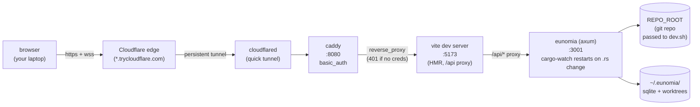

# Architecture (dev mode + remote viewing)

Two layers of "live reload" in dev, plus a tunnel layer for sharing the dev UI on the public internet behind HTTP basic auth. All three pieces are independent processes; you can restart any one without restarting the others.

## What lives where

| Process          | Port | Restarts on…                                                                                 | Owned by    |
| ---------------- | ---- | -------------------------------------------------------------------------------------------- | ----------- |
| `vite`           | 5173 | `frontend/src/**` change → in-browser HMR (no full reload)                                   | `dev.sh`    |
| `eunomia` (axum) | 3001 | `backend/src/**` or `backend/Cargo.toml` change → cargo-watch kills + relaunches the process | `dev.sh`    |
| `caddy`          | 8080 | manual only                                                                                  | `tunnel.sh` |
| `cloudflared`    | —    | manual only                                                                                  | `tunnel.sh` |

`dev.sh` and `tunnel.sh` run in separate terminals and don't know about each other. Restarting `eunomia` (the most common dev event) does not affect Caddy, cloudflared, or the public URL — the browser sees a brief 502 until axum is back up.

## State

- `~/.eunomia/eunomia.db` — SQLite, shared across every git repo you've ever pointed eunomia at. Sessions are scoped by `repo_root`.
- `~/.eunomia/worktrees/<sessionId>/synthesis/` — detached git worktrees, one per session.
- `REPO_ROOT` (the git repo eunomia operates on) is **whatever directory the axum process was started from**. `dev.sh` sets that to its first positional arg, defaulting to `$PWD`.

## Auth

Eunomia itself has no auth and binds `127.0.0.1` only. The tunnel layer is responsible for ingress auth.

- **Caddy basic_auth** is the cheap, no-account option used here. Caddy holds a bcrypt hash of your password; cloudflared in front of it just forwards the 401 challenge.
- **Cloudflare Access** (named tunnel + Zero Trust policy) is the better option for anything other than ad-hoc demos — supports email-OTP / IdP login, audit log, per-route policies. Quick tunnels (`cloudflared tunnel --url …`) cannot use Access; you'd need `cloudflared tunnel create` + a domain on Cloudflare first.

## Two run modes (recap)

- **Dev** (`./dev.sh [REPO_ROOT]`) — Vite serves the UI on :5173 with HMR; cargo-watch keeps eunomia auto-restarting on Rust changes; Vite's proxy bridges `/api` into the running backend. **Open `http://localhost:5173`**, not :3001.
- **Single-binary** (`eunomia serve`) — frontend assets are baked in via `rust-embed` at `cargo build --release` time. One port, one process. Use this for prod, smoke tests, or simple tunnels without Vite gymnastics. No HMR.
