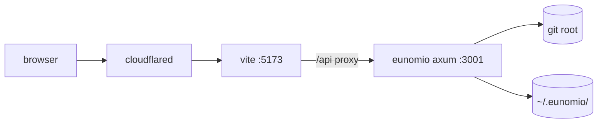
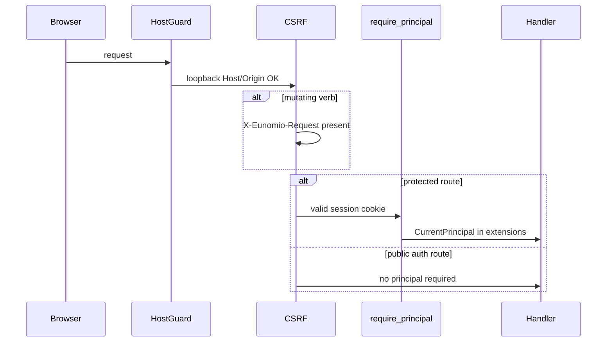

# Architecture

Maintainer reference for how eunomio is built and how it behaves at runtime. User-facing documentation lives in [`docs/`](docs/) (run `npm run dev:docs`). Canonical terminology is in [`CONTEXT.md`](CONTEXT.md).

---

## Dev mode and run modes

Two layers of live reload in dev — Vite HMR for the UI, cargo-watch for the backend — plus an optional **external** `cloudflared` process (started by `npm run dev`) for a stable public URL. The tunnel outlives backend restarts; only `cargo watch` respawns axum.



| Process | Port | Restarts on… |
| --- | --- | --- |
| `cloudflared` | — | `npm run dev` stopped |
| `vite` | 5173 | `frontend/src/**` → HMR |
| `eunomio` (axum) | 3001 | `crates/**` or `Cargo.toml` → cargo-watch |

Restarting the backend leaves Vite and `cloudflared` running — the public URL stays the same; the browser may see a brief 502 on API until axum is back.

### Crate layout

The Rust backend is a Cargo workspace under `crates/`:

```
eunomio-core              types, traits, AppError (incl. types/repo.rs row DTOs)
eunomio-helper-protocol   RunRequest, SubagentRunner trait, wire events
eunomio-keystore-file     FileKeyStore (BYOK credentials)
eunomio-sqlite            SqliteDatastore + repo modules
eunomio-auth-local        LocalAuthProvider (session cookies, login flow)
eunomio-sandbox-linux     LinuxSandboxRuntime (pass-through stub today)
eunomio-server            axum router, coordinator, middleware, tunnel
eunomio-bin-local         main() — wires trait objects and serves
```

Only `eunomio-bin-local` depends on every impl crate; `eunomio-server` sees deployment-specific behavior through `Arc<dyn …>` trait objects on `AppState` (`datastore`, `keystore`, `auth`, plus `coordinator` owning runner/quota). `SandboxRuntime` is owned by `CursorHelperRunner` (via `SubagentRunner::list_models` and run spawning), not exposed on `AppState`. There is no runtime `DeploymentMode` flag — the binary you run *is* the deployment shape.

### State directory

- `~/.eunomio/eunomio.db` — SQLite (orgs, users, org_memberships, auth_sessions, auth_events; tenant tables carry `org_id` and authorship `user_id`)
- `~/.eunomio/last_username` — last logged-in username (login form default)
- `~/.eunomio/users/<userId>/credentials` — per-user BYOK Cursor API key (mode `0600`)
- `~/.eunomio/users/<userId>/settings.json` — per-user partition settings
- `~/.eunomio/repos/<orgSlug>/<remoteSlug>/` — org-scoped managed bare clones for local and network-remote sessions
- `~/.eunomio/worktrees/<orgSlug>/<sessionId>/<partitionId>/worktree/` — one detached worktree per pending partition
- `~/.eunomio/bin/cloudflared` — auto-downloaded on first tunnel use if not on `$PATH`

### Run modes

- **Dev** (`npm run dev`) — Vite on :5173 with `/api` proxy; open `http://localhost:5173`, not :3001
- **Single-binary** (`target/release/eunomio`) — UI embedded via `rust-embed`; one port, one process; use `--enable-tunnel` for sharing

Hosted deployment design is documented separately in [`HOSTED_DEPLOYMENT.md`](HOSTED_DEPLOYMENT.md).

---

## Security and trust

Eunomio runs on the user's workstation against their own repositories.

### Auth (local mode)

There is no runtime `DeploymentMode` — the local binary (`eunomio-bin-local`) *is* local deployment. Hosted shape will be a separate binary with its own trait impls.

Local mode uses an org/user model with a singleton org (`id = 'local'`). Multiple user profiles can share one data directory; sessions are visible org-wide.

- **Session cookie** — `eunomio_local_session` (opaque server-side ID in `auth_sessions`; 30-day absolute + 7-day idle expiry; refreshed on each authenticated request)
- **Principal** — `CurrentPrincipal { user_id, org_id, role, username }` injected by `require_principal` middleware on every protected handler via a custom `FromRequestParts` extractor
- **BYOK credentials** — per-user Cursor API key at `users/<userId>/credentials`; optional one-time `CURSOR_API_KEY` env hint offered on first login (never sent to the browser)
- **Per-user settings** — partition settings at `users/<userId>/settings.json`
- **CSRF** — mutating requests require `X-Eunomio-Request: 1` (same contract as hosted)
- **Audit** — `auth_events` rows written in-transaction with login, logout, credentials changes, and session rotation
- **Helper transport** — Cursor API key passed to the helper subprocess via stdin JSON, not environment (closes `/proc/<pid>/environ` leak channel)
- **API tokens / bearer headless auth** — not implemented (deferred)

Public routes: `GET /api/auth/setup`, `POST /api/auth/login`, `GET /api/me`. All other `/api/*` routes require a valid session cookie.

Future hosted/OAuth shape: [`HOSTED_DEPLOYMENT.md`](HOSTED_DEPLOYMENT.md).



### Local trust model

The HTTP listener binds `127.0.0.1` only. The local OS user remains the outer trust boundary — any process as that user can read SQLite, credentials files, and worktrees. Application auth separates user profiles within the data directory and prepares hosted deployment.

A host guard middleware rejects requests whose `Host` or `Origin` header is not `127.0.0.1`, `localhost`, or `[::1]`, except when `--allow-dev-url` is set and `Origin` names `https://<sub>.trycloudflare.com` (Vite dev over an external tunnel). This closes CSRF from arbitrary sites and DNS-rebinding reads. The guard applies to every method, including SSE.

### Tunnel

Tunnel sharing is disabled by default. Pass `--enable-tunnel` on the release binary to enable in-app sharing (UI, token, `POST /api/tunnel`).

When enabled, `POST /api/tunnel` opens a second listener with token-checking middleware and exposes it via `cloudflared`. **The share token grants full admin access** — view diffs, accept/abandon partitions, change settings, trigger billed runs. User session cookie and `X-Eunomio-Request` CSRF header are still required for all API access via the tunnel listener (share token is an additional gate on the tunnel only).

- Rotate: `DELETE /api/tunnel` then `POST /api/tunnel`; old tokens stop immediately
- Tokens may appear in Cloudflare edge logs at first hit
- Full token is only returned on the host-gated local listener; SSE subscribers get a redacted DTO

**Dev (`npm run dev`):** `dev.mjs` runs a long-lived `cloudflared` → Vite `:5173` (stable URL in `~/.eunomio/dev-tunnel.url`). The backend uses `--allow-dev-url` so API requests with a `*.trycloudflare.com` `Origin` are accepted; it does not spawn `cloudflared` or enable the tunnel API. See [`docs/adr/0003-public-url-token-tunnel.md`](docs/adr/0003-public-url-token-tunnel.md).

### Subagents are unsandboxed

Subagents run via the embedded `cursor-helper` Node binary with eunomio's filesystem and network access. Prompt-injected agents can read secrets, write outside partition worktrees, or exfiltrate data.

Future direction: cloud-hosted Cursor agents would sandbox execution; not implemented today (`helper/src/run.mjs` uses `local: { cwd }`).

### Cloudflared binary

When `cloudflared` is not on `$PATH`, eunomio downloads a pinned release, SHA-256 verifies against embedded hashes, and extracts before execution. Mismatch deletes the download and returns `cloudflared_sha_mismatch`. See [`crates/eunomio-server/src/tunnel/install.rs`](crates/eunomio-server/src/tunnel/install.rs) for pin/upgrade procedure.

### Reporting

Open a GitHub issue with reproduction details. No coordinated disclosure process yet.

---

## Domain model (implementation)

High-level mental model for maintainers. User-facing explanations are in the docs site.

### Virtual node graph

A **Session** owns a linear chain of **Nodes** from `base` to `final`. **Edges** are derived diffs between a node and its parent. **Partitions** are the only graph-mutating primitive — each inserts one **Slice** node and reparents the target.

Seed nodes use fresh `git commit-tree` objects decoupled from the user's branch history. Position labels (`base`, `1`, `2`, …, `final`) recompute at render; **Titles** are commit subjects on branch creation.

Pending partitions expose a **candidate view** (2-node during plan, 3-node at construct review). Accepting one partition on a target auto-abandons sibling partitions on that target. No leaf-alternative preservation — see [`docs/adr/0002-partition-mutation-no-leaf-alternative.md`](docs/adr/0002-partition-mutation-no-leaf-alternative.md).

### Partition lifecycle

Two subagents under a **Coordinator**: Planner (strategy + two edge descriptions) → Constructor (writes partition worktree; returns `OK` or `BLOCKED: reason`).

HITL gates: `afterPlanning`, `afterConstruct`, and `afterIndivisible` — all default off. Forward-only except re-plan from construct review or `BLOCKED`.

Partition row fields include `phase`, `phase_state`, accepted plan JSON, candidate slice tree+commit SHA, and `worktree_path`. Row deleted on accept or abandon.

### Git mechanics

- Intermediate commits are loose objects; `nodes.commit_sha` and partition candidate SHAs keep them reachable
- Per-partition worktree: `<DATA_DIR>/worktrees/<orgSlug>/<sessionId>/<partitionId>/worktree/`, added detached at parent commit, removed on terminal action
- Constructor OK: capture worktree via `write-tree` + `commit-tree`, reset worktree to parent for re-runs
- Acceptance: insert slice node, rewrite target parent+title, abandon siblings, remove worktree
- Abandon: SIGTERM in-flight helper, remove worktree, delete partition + runs rows

### Subagents

Prompts in `subagents/<role>.md`, embedded via `rust-embed`. Backend modules per role; Coordinator dispatches by `RunKind` without inspecting output shapes.

| Agent | Writes | Output |
| --- | --- | --- |
| Planner | nothing | `Plan` JSON (strategy + exactly two edges) |
| Constructor | partition worktree | `OK` or `BLOCKED: reason` |

Diffs use `git diff --histogram`. Strategy rules constrain Constructor scope (Synthetic vs Vertical vs Horizontal).

### Persistent state

SQLite tables: `sessions`, `nodes`, `partitions`, `runs`. Pre-release schema is malleable — update `CREATE TABLE` in [`crates/eunomio-sqlite/src/db.rs`](crates/eunomio-sqlite/src/db.rs) and wipe with `eunomio --new`. No migration shims.

Partition settings live in `~/.eunomio/users/<userId>/settings.json` (per user), not on the session row.

### HTTP surface (summary)

Axum app scoped per session and partition. Key routes:

- Session CRUD, `GET /api/repo` hints
- Graph + edge diffs, generic tree diff for candidate view
- Partition begin/accept/abandon, runs, plan/construct accept
- `GET .../events` SSE for run lifecycle

Many partitions may be pending on the same target; at most one run in flight per `partition_id`.

### UI shape

React + Vite. Graph pane (`@xyflow/react`) with canonical chain + candidate dropdown. Left pane tabs: Diff, Info (read-only node details), Partition (lifecycle stepper + review components per subagent).

---

## Cursor SDK bridge

The Rust binary invokes `@cursor/sdk` via an embedded Node SEA helper subprocess. See [`docs/adr/0001-cursor-sdk-bridge.md`](docs/adr/0001-cursor-sdk-bridge.md).
