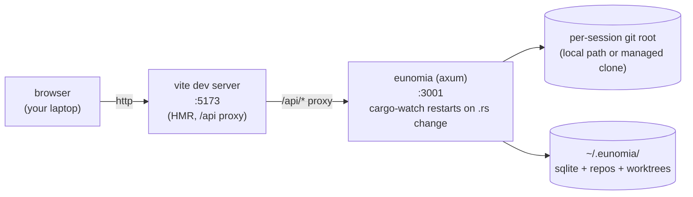

# Architecture (dev mode + remote viewing)

Two layers of "live reload" in dev — Vite HMR for the UI, cargo-watch for the backend — plus an in-app cloudflared tunnel for sharing the UI on the public internet. Dev reload and the tunnel are independent: restarting either side does not affect the other.

## What lives where

| Process          | Port | Restarts on…                                                                                 | Owned by |
| ---------------- | ---- | -------------------------------------------------------------------------------------------- | -------- |
| `vite`           | 5173 | `frontend/src/**` change → in-browser HMR (no full reload)                                   | `dev.sh` |
| `eunomia` (axum) | 3001 | `backend/src/**` or `backend/Cargo.toml` change → cargo-watch kills + relaunches the process | `dev.sh` |

Restarting `eunomia` (the most common dev event) leaves Vite running — the browser sees a brief 502 until axum is back up and the HMR socket recovers on its own.

## State

- `~/.eunomia/eunomia.db` — SQLite, shared across all sessions.
- `~/.eunomia/repos/<slug>/` — managed bare clones for network-remote sessions.
- `~/.eunomia/worktrees/<sessionId>/<partitionId>/worktree/` — detached git worktrees, one per pending Partition.
- `~/.eunomia/bin/cloudflared` — auto-downloaded when the user first starts the in-app tunnel (skipped if `cloudflared` is on `$PATH`).
- Each session carries its own repository identity (local path or remote URL); the server can start from any directory.

## Auth

Eunomia binds `127.0.0.1` only and has no application-level auth for the local user — the OS is the trust boundary.

For remote viewing, the home page's "Continue on mobile" card opens a Cloudflare quick tunnel from inside the binary and produces a QR/link containing a per-session share token. Tunnel sharing requires `--enable-tunnel` (or `--dev-tunnel` in dev). The tunnel terminates on a second loopback listener that checks the token via middleware, sets an `HttpOnly` cookie on first hit, then proxies the request through the normal router. See [`docs/adr/0003-public-url-token-tunnel.md`](docs/adr/0003-public-url-token-tunnel.md) for the rationale and the rejected alternatives (Caddy basic auth, Cloudflare Access).

The in-app tunnel is most useful in single-binary mode (below), where the same axum process serves the embedded frontend on the same port. In dev mode the tunnel exposes only `/api/*` (Vite is a separate process), so for sharing-while-iterating, run the single-binary build instead.

## Two run modes (recap)

- **Dev** (`./dev.sh`) — Vite serves the UI on :5173 with HMR; cargo-watch keeps eunomia auto-restarting on Rust changes; Vite's proxy bridges `/api` into the running backend. **Open `http://localhost:5173`**, not :3001.
- **Single-binary** (`eunomia`) — frontend assets are baked in via `rust-embed` at `cargo build --release` time. One port, one process. Use this for prod, smoke tests, or sharing via the in-app tunnel (`--enable-tunnel`). No HMR.
