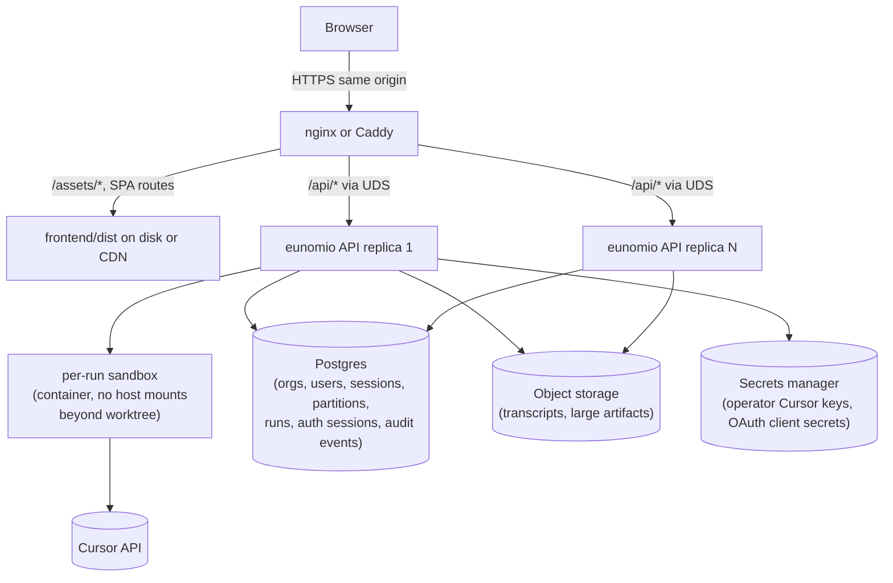

# Hosted deployment (design)

Eunomio is built to run in two deployment shapes from the same codebase: as a **local single-binary tool** (download and run on your machine) and as a **hosted web app** (multi-tenant SaaS behind a reverse proxy). This document describes the hosted design. Local dev and single-binary behavior are documented in [`ARCHITECTURE.md`](ARCHITECTURE.md).

## Design principle: one product, two wrappers

The API, frontend, and data model are shared. Deployment mode only changes how the process is started, how users authenticate, where Cursor API keys come from, and how subagent processes are isolated. The application's tenancy axis (`org_id`) is the same in both modes; in local mode there is exactly one org with one user.

The codebase is split across two repos with different licenses to support that "one product" claim while keeping the hosted business defensible. See *Code organization and licensing* below.

| | Local (single binary) | Hosted |
|---|---|---|
| **Audience** | Developer on their laptop | Orgs of developers over the internet |
| **Launch** | `eunomio` | nginx + N× `eunomio --mode hosted` |
| **Bind** | `127.0.0.1` (default) | Unix domain socket; reachable only via reverse proxy |
| **UI serving** | Embedded in binary (`rust-embed`) | Static files on nginx/CDN |
| **API** | Same axum process | Same axum binary; `/api` only via proxy |
| **Tenancy** | One org (one user, OS-bound) | Many orgs, many users per org |
| **Login** | First-run form (username; Cursor key set via UI) | GitHub OAuth (more providers later) |
| **Cursor keys** | BYOK (`~/.eunomio/credentials`) | Operator pool from external secrets manager |
| **Subagent isolation** | Kernel namespaces + seccomp (Linux) | Per-run ephemeral container |
| **Quotas / rate limits** | None (user pays Cursor directly) | Per-org hard caps (token spend + concurrency) |
| **Session cookie** | `eunomio_local_session` | `__Host-eunomio_session` (Secure, HttpOnly, SameSite=Lax) |
| **Supported platforms (v1)** | Linux | Linux |

Local download remains a first-class path when hosted exists. Hosted adds a deployment recipe; it does not replace the single-binary workflow.

## Code organization and licensing

Eunomio ships as **two repositories** with different licenses. This is the structural lever that keeps the local single-binary genuinely FOSS while reserving the hosted offering to the project.

### Two repositories

- **`eunomio`** (public, **Apache License 2.0**). Contains everything needed to build, run, and modify the local single-binary tool. Anyone can fork, distribute, and operate this code for any purpose, including commercial use, under Apache 2.0 terms.

- **`eunomio-hosted`** (private, **Functional Source License (FSL-1.1-Apache-2.0)**). Contains the hosted-mode binary and the hosted-specific trait implementations. Source-available for transparency and audit. The FSL "permitted purposes" clause forbids using the code to offer a managed/hosted service that competes with the project; after a 2-year change date each version converts to Apache 2.0 so the community has a long-term escape hatch.

The legal effect:

- A user can download the open-source `eunomio` binary, build it themselves, contribute to it, fork it, and run it locally with BYOK in any setting, including inside an organization. That binary is unambiguous OSI-approved FOSS.
- A motivated party who wants to self-host eunomio for their own organization's internal use can implement their own versions of the trait seams listed below (their own auth provider, datastore adapter, secret store, sandbox runtime, quota enforcer) and run a hosted-shaped deployment using only Apache 2.0 code. This is allowed and intended.
- A party who wants to run hosted-eunomio as a paid service to third parties using the hosted repo's implementations is restricted by FSL until the change date.

### Trait seams (in OSS)

The OSS repo exposes the boundaries between "shared core" and "deployment-specific" as Rust traits. This is the contract that lets both the local binary and the hosted binary share ~85–90% of code:

| Trait | Local impl (OSS) | Hosted impl (private repo) |
|---|---|---|
| `AuthProvider` | OS-user + first-run form | GitHub OAuth (state, PKCE, verified-email gate) |
| `KeyStore` | `~/.eunomio/credentials` file | External secrets manager (Vault/SSM/SecretManager) |
| `SandboxRuntime` | Linux namespaces + seccomp | Per-run ephemeral container |
| `Datastore` | SQLite | Postgres |
| `QuotaEnforcer` | No-op | Per-org token/concurrency caps |

The HTTP routes, middleware (CSRF, `CurrentPrincipal`, audit log), helper-subprocess protocol, SSE streaming, domain model, React frontend, and `cursor-helper` itself all live in OSS and accept these traits as parameters. Neither binary contains hardcoded "if hosted" branches.

### Repo layout (target)

```
eunomio/                          # public, Apache-2.0
  crates/
    eunomio-core/                 # domain types + traits
    eunomio-server/               # axum handlers, middleware
    eunomio-helper-protocol/      # cursor-helper wire format
    eunomio-sqlite/               # Datastore impl
    eunomio-sandbox-linux/        # SandboxRuntime impl
    eunomio-auth-local/           # AuthProvider impl
    eunomio-keystore-file/        # KeyStore impl
    eunomio-bin-local/            # local single-binary main()
  frontend/                       # React SPA (shared)
  helper/                         # cursor-helper (Node, shared)
  ARCHITECTURE.md
  HOSTED_DEPLOYMENT.md            # this doc, shipped in OSS for reference
  LICENSE                         # Apache-2.0
```

```
eunomio-hosted/                   # private, FSL-1.1-Apache-2.0
  crates/
    eunomio-auth-github/          # AuthProvider impl
    eunomio-keystore-vault/       # KeyStore impl (and SSM/SecretManager siblings)
    eunomio-sandbox-container/    # SandboxRuntime impl
    eunomio-postgres/             # Datastore impl
    eunomio-quotas/               # QuotaEnforcer impl
    eunomio-bin-hosted/           # hosted binary main()
  deploy/                         # nginx config, k8s manifests
  LICENSE                         # FSL-1.1-Apache-2.0
```

### Dependency direction

`eunomio-hosted` depends on `eunomio` as a versioned Cargo dependency (git tag during pre-1.0, crates.io release once stable). Hosted releases pin a specific OSS tag and bump it deliberately. OSS does **not** depend on or reference the hosted repo in any way — the OSS repo is self-contained and self-buildable.

### Contributor agreement

The OSS repo does **not require a CLA** at this stage. Apache 2.0 contributions are broadly licensed and can be incorporated into the FSL-licensed hosted repo without per-contributor consent — Apache 2.0 explicitly permits combination with non-Apache and proprietary code. The only future-flexibility cost is re-licensing the OSS portion *itself* (e.g., Apache → MIT, or Apache → AGPL); that's a low-probability need under the split-repo strategy. If the project later contemplates re-licensing OSS code or accepting large-scale external contributions where provenance matters, the policy can move to a CLA at that point.

### Practical implications

- The local single-binary you ship from `eunomio` is built and released entirely from public, Apache 2.0 sources. Users can build the same artifact themselves and verify the binaries match.
- Releasing the hosted binary involves bumping `eunomio-hosted`'s pinned OSS version and tagging a hosted release. Hosted CI runs against both the pinned OSS version and OSS `main` so incoming breakage shows up early.
- License headers in OSS files use the Apache 2.0 SPDX identifier; license headers in hosted-only files use the FSL identifier. A CI check enforces no file under `eunomio/` carries an FSL header.
- New cross-cutting features land in OSS first (with the trait if needed), then in the hosted repo as a new impl. No feature is implemented exclusively in the hosted repo if it could reasonably live in OSS behind a trait — the test is "would a self-hosting OSS user want this?"

## Tenancy axis: orgs with users

Every domain row that belongs to a tenant carries an `org_id` (sessions, partitions, runs, settings, audit events). `user_id` identifies the human inside an org and is used for authorship and audit, not for isolation. The application-level invariant is:

> A request with principal `(user_id, org_id)` can only read or write rows whose `org_id` matches its `org_id`. The middleware that resolves `CurrentPrincipal` from the session cookie is the one place this is enforced; handlers must not branch on tenancy themselves.

Personal accounts are modeled as **org-of-one**: signing up with GitHub auto-creates a personal org with one member (you). Teams come later as additional `org_memberships` rows; no migration of existing data needed.

Local mode runs as a degenerate case: one row in `orgs`, one row in `users`, one row in `org_memberships`. The middleware applies the same `org_id` filter.

## Option B topology

Hosted production uses a reverse proxy to serve static frontend assets and forward API traffic to the eunomio backend over a Unix domain socket. UI and API share one origin (e.g. `app.eunomio.dev`) so session cookies work without cross-origin complexity.



Backend replicas bind a Unix domain socket only (e.g. `/run/eunomio/api.sock`). nginx forwards over the socket via `upstream`. Backends are never reachable over TCP from outside the host.

### Reverse proxy snippet

```nginx
upstream eunomio_backend {
  server unix:/run/eunomio/api.sock;
  keepalive 32;
}

# Long-lived cache for hashed Vite assets.
location /assets/ {
  root /var/www/eunomio/dist;
  add_header Cache-Control "public, max-age=31536000, immutable";
  try_files $uri =404;
}

location /api/ {
  proxy_pass http://eunomio_backend;
  proxy_http_version 1.1;
  proxy_set_header Host $host;
  proxy_set_header X-Forwarded-For $proxy_add_x_forwarded_for;
  proxy_set_header X-Forwarded-Proto $scheme;

  # SSE: disable buffering and extend read timeout so streamed events flow.
  proxy_buffering off;
  proxy_cache off;
  proxy_read_timeout 1h;
}

# SPA fallback. index.html must not be cached.
location / {
  root /var/www/eunomio/dist;
  try_files $uri $uri/ /index.html;
}

location = /index.html {
  add_header Cache-Control "no-cache";
}

# Security headers applied to every response.
add_header Strict-Transport-Security "max-age=31536000; includeSubDomains" always;
add_header X-Content-Type-Options "nosniff" always;
add_header Referrer-Policy "strict-origin-when-cross-origin" always;
add_header Content-Security-Policy "default-src 'self'; img-src 'self' data:; style-src 'self' 'unsafe-inline'; script-src 'self'; connect-src 'self'; frame-ancestors 'none'; base-uri 'self'; form-action 'self'" always;
```

The React app uses relative `/api` fetches with `credentials: "include"`. No code changes are required in the frontend when moving from embedded local serving to nginx static serving, as long as both UI and API are on the same host.

### Why Option B (not proxy-everything-to-axum)

Early local mode serves UI and API from one axum process (embedded `frontend/dist/`). That pattern works for hosted too (Option A: proxy all traffic to axum), but Option B is the production default because it:

- Caches and compresses static assets at the edge
- Keeps API replicas from serving JavaScript
- Allows independent UI deploys (same release tag) without restarting API pods
- Matches conventional SPA + API hosting

Option A remains valid for smoke tests or minimal hosted setups. Local users never need nginx.

## Build and release

One release produces both artifacts:

```text
cargo build --release
  ├── eunomio                 → published for local download
  └── frontend/dist/          → copied to nginx/CDN for hosted
```

Deploy UI and API from the same release tag so they stay in sync. The hosted binary still embeds `frontend/dist/` (harmless); hosted nginx simply does not use the embed fallback in practice.

## Auth model

Every request to protected `/api/*` handlers carries a `CurrentPrincipal { user_id, org_id, role }`. Handlers scope rows by `org_id` and never branch on deployment mode directly.

### Session cookie

- **Shape:** opaque random 32-byte session ID. Persisted server-side in an `auth_sessions` table (`session_id`, `user_id`, `created_at`, `last_seen_at`, `expires_at`, `ip`, `user_agent`). Cookie carries only the ID; revocation is one row delete.
- **Attributes:** `HttpOnly`, `SameSite=Lax`, `Path=/`. Hosted: `Secure` + `__Host-` prefix (forces Secure, no Domain, Path=/, prevents same-site subdomain shadowing).
- **Naming:** distinct per mode (`eunomio_local_session` vs `__Host-eunomio_session`). A browser visiting both origins never gets cookie collisions, and a cookie's intended scope is self-evident.
- **Lifetime:** 30-day absolute expiry; 7-day idle expiry refreshed on each authenticated request. Session ID is rotated on login and on privilege change (e.g. switching active org).
- **Logout:** `POST /api/auth/logout` deletes the `auth_sessions` row and clears the cookie. Cookie alone is not enough; revocation must hit the server-side row.

### CSRF defense

Cookie-auth APIs are CSRF targets. Eunomio uses two layers:

1. `SameSite=Lax` on the session cookie. Browsers refuse to attach it to most cross-site requests.
2. **Required custom header on every mutating verb (`POST`, `PUT`, `PATCH`, `DELETE`).** Middleware rejects mutating requests that lack `X-Eunomio-Request: 1` (or whatever the agreed sentinel is). Browsers will not attach a custom header on a cross-origin request without a successful CORS preflight, and the backend never sends `Access-Control-Allow-Headers` for that header to any non-app origin, so the preflight fails. No per-session CSRF token needed.

The frontend's `fetch` wrapper adds the header unconditionally. Any endpoint that must accept an HTML `<form>` POST (rare; only OAuth callbacks today) is carved out explicitly per route.

### Local mode

- **Mode detection:** default when not passed `--mode hosted`. No `EUNOMIO_MODE` env var.
- **First visit:** if no user exists in the DB, the UI shows a login form with:
  - **Username** — prefilled with the OS username (`$USER` / `whoami`)
  - **Cursor API key** — never prefilled with a secret value. If a key was supplied at launch via `CURSOR_API_KEY`, the form shows "Detected key from environment — use it?" with a confirm button; the secret itself stays server-side until the user confirms.
- **Submit:** creates the singleton org + user + membership in one transaction (idempotent via `INSERT … ON CONFLICT` on a singleton sentinel row), writes the Cursor key to `~/.eunomio/credentials`, sets the session cookie.
- **Return visits:** session cookie → `GET /api/me` → app loads without re-login.
- **Trust boundary:** loopback bind + OS user; see [`ARCHITECTURE.md`](ARCHITECTURE.md) for tunnel share tokens (capability-based, separate from user login).

### Hosted mode

- **Mode detection:** explicit `--mode hosted` at launch; requires Postgres connection, secrets manager config, and a UDS bind path.
- **Provider for v1:** GitHub OAuth only. Other git providers (GitLab, Bitbucket) will be added later; each new provider lands as an additional row in `oauth_identities` linked to the same `user_id`.
- **OAuth flow:**
  - Server generates a random `state` value, stores it in a short-lived cookie (`__Host-eunomio_oauth_state`, 10-minute TTL, `SameSite=Lax`).
  - PKCE is used end-to-end (`code_verifier` server-side, `code_challenge` to GitHub) even though GitHub is a confidential client — defense-in-depth.
  - On callback, the server checks the returned `state` matches the cookie, exchanges the code, and fetches the user's primary email via the GitHub API. **Accounts are upserted only on `email_verified = true` for the GitHub primary email.** Unverified emails are refused with an explicit error.
  - The OAuth callback redirects the browser to the UI (not a direct API-to-UI call) with the session cookie set.
- **Multi-user:** many `users` rows, each linked to one or more `orgs` via `org_memberships`. Sessions, partitions, and runs are filtered by the active `org_id`.
- **Tunnel sharing is disabled in hosted mode.** `--enable-tunnel` is rejected at startup when `--mode hosted` is set. Two cookie-based auth schemes on one origin is a misuse magnet.

```mermaid
sequenceDiagram
  participant UI as Browser
  participant API as Backend
  participant IdP as GitHub
  participant Sandbox as Per-run sandbox
  participant Pool as Operator key pool

  Note over UI,Pool: Hosted login
  UI->>API: GET /api/me
  API-->>UI: 401
  UI->>API: GET /api/auth/login (start)
  API-->>UI: 302 to GitHub w/ state + PKCE challenge; Set-Cookie oauth_state
  UI->>IdP: follow redirect
  IdP-->>UI: 302 to /api/auth/callback?code=...&state=...
  UI->>API: GET /api/auth/callback?code&state
  API->>API: validate state cookie, exchange code, verify primary email
  API->>API: upsert user + personal org, create auth_sessions row
  API-->>UI: 302 to / + Set-Cookie __Host-eunomio_session

  Note over UI,Pool: Authenticated API call
  UI->>API: POST /api/sessions (X-Eunomio-Request: 1)
  API->>API: CurrentPrincipal from cookie + CSRF header check
  API->>API: insert session row with org_id

  Note over UI,Pool: Subagent run
  UI->>API: POST /api/partitions/:id/runs
  API->>Pool: resolve operator Cursor key (cached from secrets manager)
  API->>Sandbox: spawn cursor-helper; pass key via stdin JSON, not env
  Sandbox->>Sandbox: enforces FS + network scope
  Sandbox-->>API: stream sdk events (incl. turn-ended.usage)
  API->>API: record tokens to runs row; aggregate to org budget
```

### Trusted proxy and forwarded headers

`X-Forwarded-For` and `X-Forwarded-Proto` are spoofable if accepted from arbitrary peers. The backend honors these headers only when the connection peer matches a configured allowlist:

- `trusted_proxy_cidrs` — IP CIDRs whose `X-Forwarded-*` headers are honored. Empty by default; an operator fronting eunomio with nginx adds nginx's IP/CIDR or `127.0.0.1/32`.
- For UDS binds, the peer is identified by socket path rather than IP; the same allowlist mechanism honors a UDS peer when the path is configured.

Outside the allowlist, the backend uses the connection peer for rate-limit/audit purposes and ignores forwarded headers. `Secure` cookie generation depends on the validated `X-Forwarded-Proto` (or TLS termination at the backend, which is not the default in Option B).

### Audit log

An `auth_events` table records: login (success / failure / unverified email refusal), logout, session rotation, OAuth identity link/unlink, org membership change, plan change, operator key rotation. Each row carries `org_id`, `user_id` (when known), `event_type`, `ip`, `user_agent`, `created_at`, and `details_json`. Audit events are written in the same transaction as the operation they describe.

### Public (unauthenticated) routes

- `GET /api/auth/setup` — **local only** (router returns 404 in hosted, not just by convention). Suggested username, presence-of-launch-env-key indicator.
- `POST /api/auth/login` — local only.
- `GET /api/auth/oauth/github/start`, `GET /api/auth/oauth/github/callback` — hosted only.
- Static assets (no auth middleware on HTML/JS/CSS). `index.html` must not embed user-specific bootstrap data.

### CORS

Hosted runs same-origin only. The backend does **not** emit `Access-Control-Allow-Origin` for any non-app origin and **never** combines `Access-Control-Allow-Origin: *` with `Access-Control-Allow-Credentials: true`. Cross-origin development (Vite on `:5173` against backend on `:3001`) is handled by Vite's `/api` proxy, not by CORS.

## Cursor API key resolution

All Cursor SDK calls go through a single resolver. Deployment mode selects the source:

| Mode | Source | Storage |
|---|---|---|
| **Local** | User's own key (BYOK) | `~/.eunomio/credentials` (mode `0600`) |
| **Hosted** | Operator pool | External secrets manager, fetched at boot |

### Transport into the helper subprocess

The `cursor-helper` subprocess reads its job description from stdin as a single JSON request (today: `{ model, cwd, prompt, runId }`). The Cursor API key is added to that JSON envelope as `cursorApiKey` and **never placed in the subprocess environment**. Rationale: `CURSOR_API_KEY` in env is readable via `/proc/<pid>/environ` to any process running as the same uid; in hosted with per-run containers and `/proc` masked this is moot, but in local single-binary on a shared workstation it's a real leak channel. Stdin-only is the symmetric and safer transport.

The helper unsets `process.env.CURSOR_API_KEY` immediately after parsing the stdin payload, even if it happens to be set, so child processes the SDK spawns do not inherit it.

### Local credentials file

Path: `~/.eunomio/credentials` (JSON, mode `0600`):

```json
{ "cursorApiKey": "..." }
```

At process boot, the effective key is resolved as:

1. Existing credentials file (the persisted choice).
2. `CURSOR_API_KEY` env, **for this process only**. Cleared from the process env after read; never written to the credentials file.
3. Unset → UI shows the first-run flow asking the user to paste a key.

There is no `--cursor-api-key` CLI flag. Passing secrets via argv puts them in `ps`, shell history, and any process-listing telemetry. Scripts that need to inject a key set `CURSOR_API_KEY` before launching eunomio; that value is used for the current run and not persisted.

Persistence to `~/.eunomio/credentials` happens only via explicit UI action (first-run form, or a later Settings page). The env-supplied key is per-run and disappears with the process.

### Hosted: operator key pool

Keys are pulled from an external secrets manager (Vault / AWS Secrets Manager / GCP Secret Manager / similar) at process boot and cached in memory. Configuration points the backend at the secret name; the backend never reads from a file or env var for production keys. Key rotation: rotate in the secrets manager, then signal replicas to refetch (SIGHUP or admin endpoint). Operator must not bake keys into deployment manifests, env files, or container images.

The pool also serves as the budgeting boundary: a hosted instance may rotate among several operator keys for throughput/redundancy, but cost attribution is per-org (see *Per-org quotas* below), independent of which pool key was used.

Hosted mode **does not read or accept user-supplied Cursor keys**. BYOK in hosted complicates encryption-at-rest, rotation, leakage scope, and metering attribution; the operator-pool model is simpler and aligns with billing.

## Subagent process isolation

Eunomio uses the Cursor SDK's local runtime — the agent process runs on the eunomio host against a worktree on local disk. The SDK does not provide a tenant sandbox; eunomio must.

### Sandbox contract

Every `cursor-helper` invocation runs inside a sandbox that enforces, before user prompt is read:

- **Filesystem scope:** read+write access to the partition's worktree (`~/.eunomio/worktrees/<sessionId>/<partitionId>/worktree/` or the hosted equivalent) and a small scratch dir; readonly access to a minimal toolchain (`git`, `node`, `rg`, etc.). No access to other worktrees, the credentials file, `~/.ssh`, the secrets cache, or `/proc/*/environ`.
- **Network scope:** outbound to (a) the Cursor API endpoints used by the SDK, and (b) the session's git remote host. Everything else — RFC1918, link-local, cloud metadata IPs, arbitrary internet — is blocked.
- **Process scope:** dropped privileges, no ability to ptrace siblings, no setuid binaries, resource limits (CPU time, memory, file descriptors, open processes).

The contract is identical in local and hosted; only the implementation differs:

| Mode | Implementation |
|---|---|
| **Local (Linux)** | Kernel namespaces (mount, pid, net, user) + seccomp filter + bind mounts. In-binary, no external runtime required. |
| **Hosted (Linux)** | Per-run ephemeral container (rootless containerd / Firecracker / similar) with the worktree bind-mounted and outbound network filtered. The in-binary sandbox layer still applies inside the container as defense-in-depth. |

**Mandatory, no opt-out.** A platform is supported only if eunomio can sandbox on it. v1 ships Linux only for both local and hosted. macOS and Windows local builds wait until their respective sandbox implementations land.

## Hostile git remotes

Users supply remote URLs that eunomio clones server-side. A hostile remote is two attacks in one: SSRF (clone target points at an internal network) and RCE (git hooks, submodules, `core.fsmonitor`, lfs filters, file:// transports). The sandbox above covers most of the RCE blast radius; the rest is enforced at the git layer before the worktree even exists:

- **Egress allowlist** validates the resolved remote IP against a deny set (RFC1918, link-local 169.254.0.0/16, cloud metadata 169.254.169.254, loopback, IPv6 ULA/link-local). DNS resolution happens in the backend and the resolved IP is locked in for the clone; clone connects to the IP, not the hostname, to defeat DNS rebinding.
- **Hooks disabled:** `core.hooksPath=/dev/null` for all eunomio-initiated clones and fetches.
- **No file:// transport:** `protocol.file.allow=never`; `protocol.allow=https,ssh` allowlists transports.
- **Submodules off by default:** clones never recurse submodules; an explicit per-session opt-in is required, and submodules go through the same allowlist.
- **Resource limits:** clone has a max-bytes budget (`core.maxBlobSize` + size-of-pack limit), wall-clock timeout, and is killed cleanly if exceeded.
- **Credentials helpers disabled:** `credential.helper=` (empty) so the backend never accidentally uses the host's git credential store.

These rules apply identically in local and hosted; in local they are defense-in-depth against prompt-injection rather than tenant-vs-tenant attack.

## Per-org quotas and rate limits

Per-org hard caps are a **launch precondition for hosted**, not a v2 feature. A single abusive org sharing an operator key can drain the pool and bill the operator.

### Usage measurement

The Cursor SDK emits `turn-ended` events on its stream with `usage: { inputTokens, outputTokens, cacheReadTokens, cacheWriteTokens }`. The helper forwards these events; the backend stores per-run token totals on the `runs` row and aggregates per `org_id` per billing window.

### Enforcement points

- **Token spend cap (hard):** each org has a plan-defined max tokens per window. When the running aggregate would exceed the cap, the backend refuses to start new runs and surfaces a `RateLimited` error to the UI with the next reset time. In-flight runs are not killed mid-flight; the cap applies at run-start.
- **Concurrent runs cap (hard):** each org has a max simultaneous `cursor-helper` processes. New runs queue or are rejected when the cap is hit.
- **Per-user fairness:** within an org, a single user cannot consume more than N% of the org budget per window (configurable, defaults applied).
- **Upstream backstop:** the Cursor SDK can return `RateLimitError` from Cursor itself. The backend surfaces this distinctly from app-level limits so operators know whether the bottleneck is their plan or upstream.

Plan definitions, billing integration, and self-service plan changes are out of scope for v1 hosted; the cap mechanism uses configured defaults and admin-set per-org overrides.

## Data and tenancy

| Mode | Datastore |
|---|---|
| **Local** | SQLite at `~/.eunomio/eunomio.db` |
| **Hosted** | Postgres (managed or self-hosted) |

The two engines run different code paths only where the SQL dialect genuinely diverges (UPSERT clauses, JSON ops, advisory locks). Application code uses a portable query subset; dialect-specific helpers are isolated in a small module per query. Schema is the same shape in both stores: every tenant-scoped row carries `org_id`, with foreign keys back to `orgs(id)`.

Hosted-specific resources:

- **Postgres** for relational state. Connection pool per replica.
- **Object storage** (S3-compatible) for large blobs (run transcripts, oversize artifacts).
- **Isolated git storage per partition** in the host filesystem, sandbox-mounted into the helper container.
- **Session ownership enforced via the `CurrentPrincipal` middleware** on every API access. Handlers do not write SQL without the middleware-provided `org_id` parameter.

The `orgs`, `users`, `org_memberships`, `oauth_identities`, `auth_sessions`, `auth_events`, and `org_quotas` tables, along with `org_id` columns on existing tables, land with the `--mode hosted` work; they are not required to exist before that work begins. The current single-user schema in `db.rs` remains valid for local mode and is migrated forward without data loss when the org/user model lands.

## Frontend serving comparison

| Context | Who serves UI | Who serves `/api` |
|---|---|---|
| Dev | Vite `:5173` (HMR) | axum `:3001` |
| Local single binary | axum embed fallback | same axum process |
| Hosted | nginx / CDN (`frontend/dist`) | axum behind `/api` proxy over UDS |

The SPA uses client-side routing (`/`, `/sessions/:id`, `/settings`). nginx must fall back to `index.html` for unknown paths. The axum embed fallback already does this for local single-binary mode.

Avoid split origins (UI on `app.example.com`, API on `api.example.com`) unless you invest in cross-origin cookie and CORS setup. Same-origin is the default.

## Hosted launch preconditions

These must all be true before opening hosted to multi-tenant traffic. Soft launches to a single trusted org tier may proceed without some, with explicit decisions logged.

- Trait seams (`AuthProvider`, `KeyStore`, `SandboxRuntime`, `Datastore`, `QuotaEnforcer`) factored out in the OSS repo; OSS local binary builds and runs from those seams via the local implementations.
- `eunomio-hosted` private repo exists with hosted implementations of those traits; depends on a pinned `eunomio` OSS tag.
- License headers in place: Apache-2.0 in OSS, FSL-1.1-Apache-2.0 in hosted; CI enforces no FSL header leaks into the OSS repo.
- `--mode hosted` implemented in the hosted binary; binds UDS; rejects `--enable-tunnel`.
- Postgres-backed `orgs`, `users`, `org_memberships`, `auth_sessions`, `auth_events`, `org_quotas` schema deployed.
- GitHub OAuth integrated with `state` + PKCE; account creation gated on `email_verified` primary email.
- Session cookie uses `__Host-` prefix, `SameSite=Lax`, `HttpOnly`, `Secure`; CSRF custom-header middleware in place on all mutating verbs.
- Sandbox contract implemented and enforced for every helper invocation (container in hosted, kernel namespaces in local).
- Hostile-remote hardening: egress allowlist + git config restrictions + clone size/time limits.
- Per-org hard caps on token spend and concurrent runs, enforced at run-start.
- Operator Cursor keys sourced from an external secrets manager; never from disk or env on app nodes.
- Cursor key passed to helper via stdin JSON, never env.
- Trusted-proxy CIDR/UDS config in place; forwarded headers honored only from configured sources.
- Security headers shipped in the canonical nginx config (HSTS, CSP, X-Content-Type-Options, Referrer-Policy, cache directives for assets vs `index.html`).
- `auth_events` audit log written in-transaction for all auth state changes.
- Tunnel sharing disabled.

## Out of scope (for now)

These are part of the eventual hosted product but not required for the v1 hosted launch:

- Self-service plan management and billing (Stripe-style flow)
- Provider expansion beyond GitHub (GitLab, Bitbucket, Google)
- macOS / Windows single-binary local builds (waiting on per-platform sandbox)
- Multi-region deployment and data residency
- WebAuthn / TOTP second factor on hosted accounts
- Team / org admin UI beyond membership invites
- CI/CD and nginx config as code in this repo
- Cross-origin split-domain deployment

## Related documents

- [`ARCHITECTURE.md`](ARCHITECTURE.md) — local dev, single-binary mode, tunnel sharing
- [`docs/adr/0003-public-url-token-tunnel.md`](docs/adr/0003-public-url-token-tunnel.md) — share-token tunnel (local)
- [`README.md`](README.md) — project overview and build instructions
