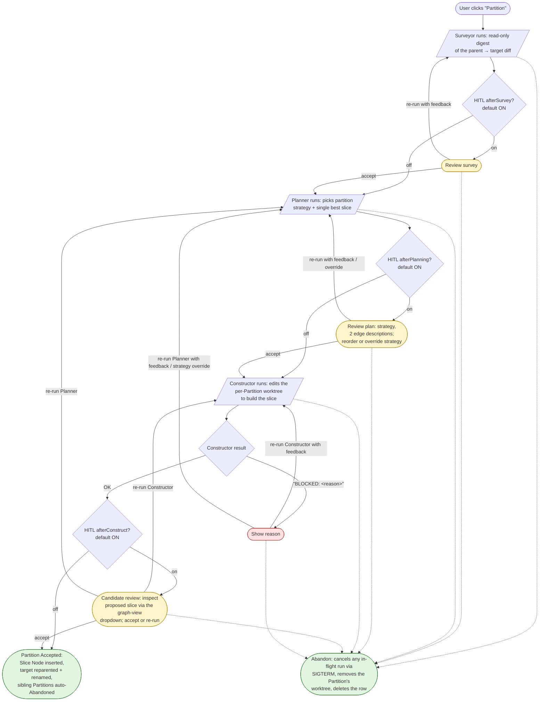
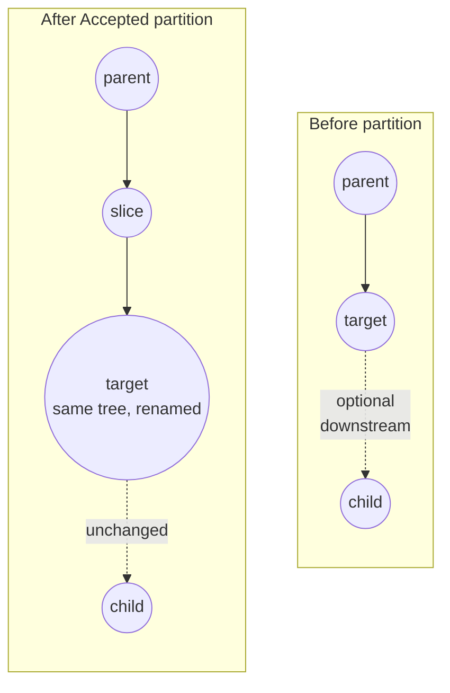

# Eunomia

A standalone tool for turning a noisy "ref A → ref B" diff into a clean, reviewable commit history by exploring a graph of synthesized commits.

The stack is React/Vite/Tailwind/shadcn for the UI, a Rust axum backend with SQLite for state, and one git worktree per pending Partition for the commit-construction sandbox. The Cursor SDK is invoked via a small Node helper compiled into a single self-contained executable and embedded into the Rust binary at release time.

## Layout

```
backend/    Rust axum + rusqlite binary crate `eunomia`
frontend/   Vite + React + TS + Tailwind + shadcn
subagents/  prompt markdown for surveyor/planner/constructor (planned)
plans/      design plans (gitignored; local-only working drafts)
```

See [`SPEC.md`](SPEC.md) for the conceptual model and [`CONTEXT.md`](CONTEXT.md) for canonical terminology.

## Partition lifecycle

A **Partition** carves one Edge of the graph into two consecutive commits, supervised by three AI subagents — `Surveyor` → `Planner` → `Constructor` — driven by a `Coordinator` that owns the phase machine and the human-in-the-loop (HITL) review gates. Many Partitions can be pending in a Session at once, including more than one on the same target.



**HITL defaults.** All three gates (`afterSurvey`, `afterPlanning`, `afterConstruct`) default to `true` — every Session starts in fully supervised mode. Any combination can be turned off in Partition settings for a more automated run; the SDK call still happens, the gate just doesn't park.

**Re-run paths.** From any review gate, accept-or-rerun is symmetric. From either of the two construct-phase terminals (the `construct_review` state after OK and the `BLOCKED` state) the user gets an additional back-edge: re-run the Planner with feedback and an optional strategy override if the slice it identified turned out to be wrong. The accepted Survey is preserved across re-Plan; only the plan + construct work is discarded. This is the only back-edge in the lifecycle; everywhere else is forward-only.

**Abandon.** A one-click action available from every non-terminal state, including with a run in flight. Sends `SIGTERM` to the helper subprocess so the SDK's server-side compute stops billing as quickly as possible (SIGKILL would leave it running until natural completion), deletes the Partition row, and removes the Partition's worktree.

**Parallel Partitions.** Each Partition owns its own synthesis worktree, so Constructors from different Partitions run literally in parallel. The constraint is one actively-running phase per `(session, target)` at any moment; sibling Partitions on the same target sit at their review gates while one of them executes.

## Graph mutation per partition

An Accepted Partition adds one new Slice Node to the graph, reparents the target onto it, and rewrites the target's Title to the Planner's description of the leftover edge:



- **slice** — new Node whose tree is what the Constructor built. `slice.title = edges[0].title` from the accepted Plan.
- **target** — same Node as before, with two fields mutated: `parent_node_id` flipped to `slice.id`, and `title` rewritten to `edges[1].title`. Tree, `commit_sha`, and downstream children are unchanged.
- The graph after a Partition is a strictly linear extension of the chain. There are no leaf alternatives. The original target node's pre-Partition title is gone — see [`docs/adr/0002-partition-mutation-no-leaf-alternative.md`](docs/adr/0002-partition-mutation-no-leaf-alternative.md) for the reasoning.

The on-graph display uses short **Position labels** — `base`, then `1, 2, 3, …` for intermediate Slices by chain distance from `base`, then `final` — recomputed at render time. A Node's full Title appears in the Node-detail inspector when the Node is selected.

When a Partition is pending in `construct_review` (Constructor returned OK, awaiting user Accept), it does not yet appear in the canonical chain. The user inspects the proposed graph state via a dropdown on the graph view that switches the graph pane into a 3-Node mini-graph for the candidate — same Diff machinery, just scoped to the prospective `parent → slice → target` shape.

## Dev

```bash
npm install
npm run dev
```

Vite serves the UI on `:5173` (proxying `/api` to `:3001`); the backend runs on `:3001` and uses the `cargo watch` cwd as `REPO_ROOT`.

## Build

```bash
npm run build
```

Produces `target/release/eunomia` (workspace target dir, not `backend/target/`), a single binary that serves UI + API on one port. Run it from any git repo to use that repo as `REPO_ROOT`.

```bash
cd /path/to/some/git/repo
/path/to/eunomia/target/release/eunomia serve --port 3001
```

To put it on your PATH, symlink it to a directory already on `$PATH`:

```bash
ln -sf /path/to/eunomia/target/release/eunomia ~/.local/bin/eunomia
```

State (SQLite DB + per-Partition synthesis worktrees) lives in `~/.eunomia/`, shared across every repo a user runs Eunomia against.

### Pre-release note: stale dev DBs

This project is pre-release; the schema is treated as malleable and migration code for legacy columns is not kept around. If `eunomia` fails to start on a database written by an older revision, delete `~/.eunomia/eunomia.db` and any leftover worktrees under `~/.eunomia/worktrees/` and start fresh.
