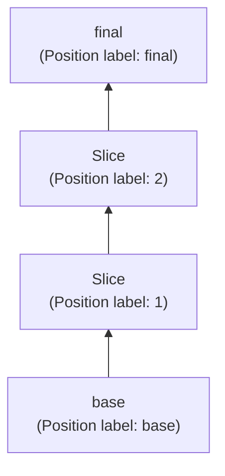
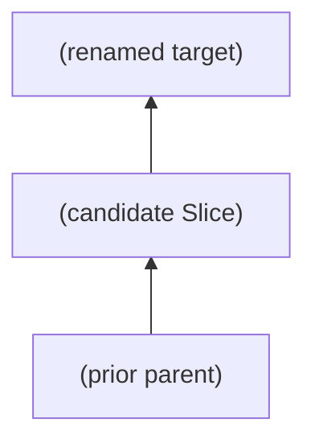
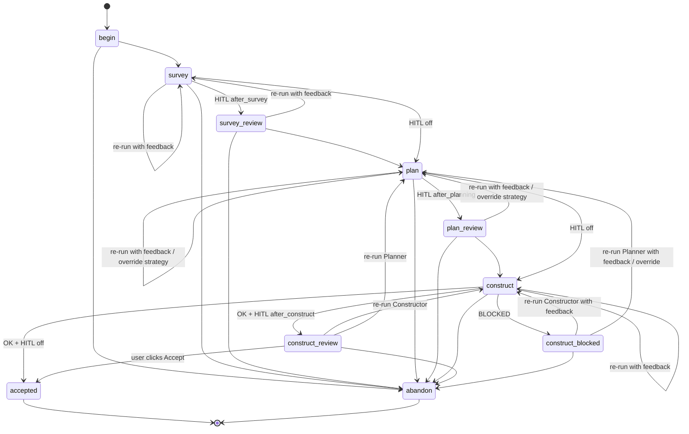
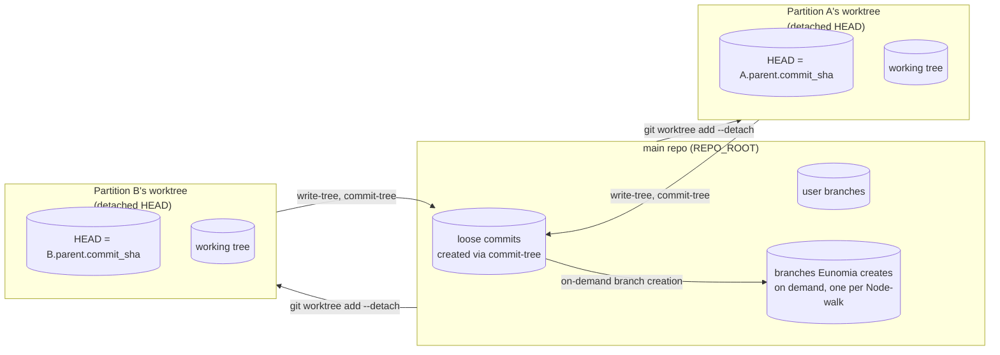

# Eunomia — Commit Review Specification

> This document is a high-level mental model, not an implementation manual.
> Read it to understand the shape of the system; the per-component plans in
> `plans/` and the canonical glossary in `CONTEXT.md` are the implementation
> references.

---

## 1. What Eunomia is

A standalone tool for turning a noisy "ref A → ref B" diff (a feature branch,
a rebase scratch space, or any pair of refs) into a **clean, reviewable commit
history**.

The user does **not** hand-edit commits. Instead they steer a small fleet of
AI subagents that propose, plan, and construct one commit at a time, carving
the original diff into successively finer pieces inside an isolated worktree.
The resulting graph of virtual commits is explorable; from it the user can
spin off real branches at any time by selecting a node and walking back to
base.

Think of it as: "I have a messy WIP branch. I want a PR with 3-7 logical
commits and the same final code." Eunomia is the orchestration layer that
makes that happen.

---

## 2. Core mental model: the virtual node graph

The unit of work is a **Session**. Inside a Session every commit is a Node;
the active state of the Session is a single linear chain of Nodes from
`base` to `final`.

- **Node** — a full cumulative tree state plus a commit sha that points at
  that tree, plus a per-Node `Title`.
- **Edge** — the diff between a Node and its parent. Edges are derived, not
  stored; identified by their target Node.
- Every Session starts with exactly two Nodes:
  - `base` — tree of the merge-base of `baseRef` and `sourceRef`.
  - `final` — tree of `sourceRef`, parented on `base`.
- All later activity inserts **Slice** Nodes between an existing Node and
  its parent. There is always exactly one chain `base → … → final`; there
  are no alternative paths in the canonical graph.



The user sees the chain rendered with short **Position labels** — `base`,
integer chain distances `1, 2, 3, …`, and `final` — _not_ each Node's full
`Title`. Position labels recompute at render time as the chain grows. Titles
are descriptive prose used as commit subjects on branch creation; they live
in the Node-detail inspector, not on the graph card.

### Pending Partitions and the candidate view

While a Partition is in progress (see §3), no graph mutation has happened yet
— the candidate Slice and the proposed rewrite of the target's Title sit on
the Partition row, not on the active chain. The user can switch the graph
view into a **candidate view** for any pending Partition to inspect what its
Acceptance would produce.

The candidate view is a 3-Node mini-graph:



The same Diff machinery applies: selecting any Node in the mini-graph renders
that Node's incoming-edge diff in the Diff tab. The mini-graph's Position
labels are the labels the Nodes _would have_ after Acceptance, so the user
sees the proposed renumbering before committing to it.

Many Partitions can be pending at once — including more than one on the same
target — and each appears as an entry in the graph-view dropdown. Acceptance
of any Partition on a given target auto-Abandons all sibling Partitions on
that same target (see §3).

### Branching out of the graph

The graph itself is never "exported." Instead, at any time, the user can
**create a real git branch from any Node** in the graph:

1. User picks a Node `H` (the head) and a branch name.
2. The system walks `H` → `parent` → … → `base`, producing an ordered list
   of Nodes.
3. For each non-base Node in that list, in order, a fresh commit is created
   with `git commit-tree` using `node.title` as the subject, parented on the
   previous step's commit. The base Node's commit is the chain's root.
4. `git branch [-f] <branchName> <tip>` exposes the result as a real branch.

The branch's tip tree equals `H.treeId` by construction. The head need
**not** be `final`: the user is free to spin off a branch from any
intermediate Slice. If they want a branch whose tip matches `final`, they
pick `final`.

Branching never pushes, never fetches, and never touches the user's working
copy. Branching is read-only with respect to the Node graph — it never
inserts, removes, or modifies Nodes.

---

## 3. The single primitive: Partition

Every change to the graph after `createSession` happens through **edge
partitioning**. There are no other graph-mutating primitives.

A **Partition** takes one Edge of the graph (identified by its target Node)
and **carves it into two consecutive Edges** by inserting a single new
**Slice** Node between the target and its prior parent. After Acceptance:

```
parent ──Edge──▶ target            becomes            parent ──┐
                                                              ▼
                                                            Slice
                                                              │
                                                              ▼
                                                            target
```

The Slice is the first of the two new commits. The target Node stays in
place — its tree is unchanged — but its `parent_node_id` is reparented onto
the Slice and its `Title` is rewritten to describe the second Edge
(`Slice.tree → target.tree`). The target's `commit_sha` becomes stale with
respect to the new chain (its on-disk parent commit no longer matches the
DB), which is fine because Edges are derived (§2) and branch creation
rebuilds commits via `commit-tree` (§4).

There is **no leaf-alternative preservation**. The original target is _the_
target; nothing forks off the prior parent to keep the pre-Partition state
around as a separate path. See `docs/adr/0002-partition-mutation-no-leaf-alternative.md`
for the reasoning behind this choice.

### Three subagents

A Partition is driven by three single-purpose AI subagents under a
Coordinator. The Coordinator owns the phase machine and review gates; the
subagents do the work:

- **Surveyor** — reads the diff `parent.tree → target.tree` and emits a
  structured ChangeSurvey: a summary plus a list of independent **themes**
  it identified. Read-only.
- **Planner** — reads the ChangeSurvey plus the diff, **decides the
  Partition strategy** (Synthetic / Vertical / Horizontal — see below), and
  emits a Plan: a `strategy` value, a one-sentence rationale, and **exactly
  two edge descriptions** in order. `edges[0]` is the Slice the Constructor
  will build; `edges[1]` is the leftover edge (informational; never
  explicitly constructed because its tree is the target's existing tree).
  Both edge titles will become commit subjects on branch creation. Read-only.
- **Constructor** — given the accepted Plan, edits the Partition's worktree
  so that the worktree tree matches the Slice the Plan describes.
  Returns exactly one line: `OK` or `BLOCKED: <reason>`. The only writable
  subagent.

The user has no upfront strategy selector. The Planner picks the strategy
that fits the diff best on its first run. At the Plan Review gate the user
can ask for a re-plan with a different strategy as a per-Partition override;
there is no global pin in settings.

All diff invocations the subagents make use `git diff --histogram` for
smaller, more readable hunks on code-movement diffs. Backend helpers that
materialise diffs for subagents do the same.

| Strategy       | Intent                                                                                                       | Slice shape                                                                |
| -------------- | ------------------------------------------------------------------------------------------------------------ | -------------------------------------------------------------------------- |
| **Synthetic**  | Extract one topically coherent theme that requires a synthesized intermediate to separate cleanly from the rest. | A slice tree containing content in neither BeforeTree nor TargetTree, chosen so the slice expresses the theme without applying any other. |
| **Vertical**   | Extract a thin end-to-end tracer-bullet slice that cuts through every layer touched by the diff.              | The slice and the leftover both make end-to-end sense in isolation.         |
| **Horizontal** | Extract one architectural layer.                                                                              | The slice owns one layer; the leftover owns the other layers in foundation order. |

There is no upfront user prose attached to a Partition. The user influences
the slicing only by reviewing each Phase's output and supplying optional
`user_feedback` when asking for a re-run at a Review gate; the supplied
feedback is interpolated into the next Run's prompt for that role.

### Lifecycle of one Partition

A Partition is one survey-plan-construct loop, gated at three optional
human-in-the-loop review points: `afterSurvey`, `afterPlanning`, and
`afterConstruct`. All three default to `true` (supervised mode); the user
can turn any off in settings.



A Partition row is keyed by an autoincrement `id` and carries:

- `session_id`, `target_node_id`
- `strategy` (nullable; set when the Planner's output is Accepted)
- accepted `change_survey_json`, `plan_json`
- `phase` (`survey` | `plan` | `construct`) and `phase_state`
  (`running` | `awaiting_review` | `error`)
- `candidate_slice_tree_sha`, `candidate_slice_commit_sha` (nullable; set
  when the Constructor returns OK and `afterConstruct` is on, or just before
  Acceptance when it's off)
- `worktree_path` — the Partition's own worktree (see §4)

The row exists only between Begin and a terminal action. Acceptance and
Abandon both delete it. The Session's record that a Partition ever
happened is implicit in the Slice Node it produced (Acceptance) or in
nothing at all (Abandon) — there is no separate audit log table.

### Parallel pending Partitions

Many Partitions can be pending in a Session at once:

- **Per Session**: any number of pending Partitions. Surveys and Plans of
  different Partitions run truly in parallel (read-only).
- **Per `(session, target_node_id)`**: any number of pending Partitions —
  the user can run alternative Partitions on the same target (e.g. one
  Vertical, one Horizontal) and compare. At most one of them has an
  actively-executing phase (a Survey, Plan, or Construct currently running)
  at any moment.
- **Per Session, for the Constructor**: no global lock. Each Partition has
  its own worktree (§4), so two Partitions can run their Constructors
  literally in parallel.

### Sibling auto-Abandon

When the user Accepts a Partition on target T, T is mutated (reparented
onto T's new Slice, Title rewritten). Sibling Partitions on T were computed
against T's pre-Accept parent and become structurally invalid. The
Acceptance transaction therefore auto-Abandons every other pending
Partition on T:

- Their rows are deleted.
- Their candidate commits become orphaned in the git ODB (eventually GC'd).
- Their worktrees are removed via `git worktree remove --force`.
- Their `runs` rows are deleted.

The UI confirms the auto-Abandon when sibling Partitions exist.

### Forward-only with one back-edge

The lifecycle is forward-only except from the two terminal states of the
Construct phase (`construct_review` after OK and `construct_blocked` after
BLOCKED): from either, the user can re-run the Planner (with feedback and
optional strategy override) to pick a different slice without losing the
accepted Survey. The previous Construct's reason or candidate is
auto-prepended to the new Planner run's prompt as additional context.

There are no other back-edges. To re-run the Survey, or to back up from a
non-blocked state, the user must Abandon and Begin a new Partition.

---

## 4. Git mechanics

This is the part that is easy to get wrong, so it gets its own section.

### Refs and trees

Eunomia never writes to any user-visible branch except the explicit branches
the user asks to create. All intermediate commit objects are loose — they
exist in the object database but no ref points at them. They survive across
restarts because `nodes.commit_sha` and `partitions.candidate_slice_commit_sha`
keep them reachable, and ultimately through git's reflog and any
user-created branches.

Two trees drive every Session-level decision:

- `baseTree` = `merge-base(baseRef, sourceRef)^{tree}`
- `finalTree` = `sourceRef^{tree}`

The base commit and final commit used in the graph are **fresh
`git commit-tree` objects** pointing at these trees, not the user's original
commits. This decouples Eunomia's history from the user's branch history and
guarantees the parent chain of Nodes is exactly what Eunomia wrote.

### Per-Partition worktrees

Each pending Partition owns its own git worktree:

```
<DATA_DIR>/worktrees/<sessionId>/<partitionId>/worktree/
```

It is added with `git worktree add --detach <path> <parent.commit_sha>` in
the `begin_partition` route. It serves as `cwd` for every Run of that
Partition — Surveyor, Planner, Constructor — and is removed (via
`git worktree remove --force`) in the same transaction as the terminal
action (Accept or Abandon).

Per-Partition worktrees decouple the Constructor from any global lock. Two
Partitions can run their Constructors in parallel because each writes to
its own directory under its own HEAD.



### Constructor returns OK: capture the candidate

When a Constructor returns `OK`, the Coordinator captures the worktree state
into a loose commit and parks the Partition at `construct_review`:

```
git -C <partitionWorktree> add -A
candidateTreeSha   = git -C <partitionWorktree> write-tree
candidateCommitSha = git -C <REPO_ROOT> commit-tree candidateTreeSha \
                       -p parent.commit_sha -m edges[0].title
git -C <partitionWorktree> reset --hard parent.commit_sha
git -C <partitionWorktree> clean -fdx
UPDATE partitions
  SET candidate_slice_tree_sha   = candidateTreeSha,
      candidate_slice_commit_sha = candidateCommitSha,
      phase                      = 'construct',
      phase_state                = 'awaiting_review'
  WHERE id = ?;
```

The worktree is reset back to the parent commit so a subsequent re-run
starts from a clean baseline. The candidate commit is loose; nothing in
`nodes` references it yet.

When `humanInTheLoop.afterConstruct = false`, this same capture happens and
Acceptance proceeds atomically without parking — there is no observable
`construct_review` state.

### Acceptance: insert the Slice, rewrite the target

When the user Accepts (or auto-Accept fires under `afterConstruct = false`),
one transaction:

```sql
INSERT INTO nodes (session_id, node_id, parent_node_id, tree_sha, commit_sha, title, created_at)
  VALUES (?, ?slice_id, ?parent_id, ?candidate_slice_tree_sha, ?candidate_slice_commit_sha, ?edges[0].title, ?now);

UPDATE nodes
  SET parent_node_id = ?slice_id, title = ?edges[1].title
  WHERE session_id = ? AND node_id = ?target_id;

DELETE FROM partitions WHERE id = ?;
-- Plus sibling auto-Abandon for any other pending Partition on the same target.
```

Then `git worktree remove --force` on the Partition's worktree, and emit
`SseEvent::Finished` to the bus.

### Abandon

Abandon is one-click and always succeeds, including when a Run is in
flight. Sequence (Coordinator-side, without releasing the per-Partition
lock):

1. Mark the Partition as abandoning in the Coordinator's in-memory state
   (used to drop any late helper events for this Partition).
2. If a Run is in flight: signal the helper with `SIGTERM` so the SDK's
   `run.cancel()` is called server-side **immediately** (so token billing
   stops), abort the stdout-reader task, mark the run row `cancelled`.
3. Emit `SseEvent::Cancelled`.
4. `git worktree remove --force <partitionWorktree>`.
5. Delete the partitions row and its `runs` rows. The candidate commit, if
   one was captured, becomes orphaned in the git ODB (eventually GC'd).

The Coordinator does not wait for the helper to finish cancelling before
proceeding — the helper drains in the background.

### Creating a branch from the graph

There is no global "export" step. Whenever the user wants a real branch:

1. User picks any Node `H` and a branch name `B`.
2. Walk `H` → `parent` → … → `base`. Call the list `[base, N1, N2, …, H]`.
3. Starting with `parent = base.commit_sha`, for each non-base `Ni` in
   order: `parent = commit-tree(Ni.tree, parent, Ni.title)`.
4. `git branch [-f] B <parent>`.

`H.tree` is whatever the user chose; the resulting branch has that tree as
its tip. The reason for re-creating commits at branching time (rather than
reusing `commit_sha`) is so each commit's subject is `node.title` and not
the placeholder messages used internally. It also means the branch's
history is self-contained and shareable.

### Invariants the system depends on

- Every non-`base` Node has exactly one parent.
- The canonical chain is linear: walking parents from any Node terminates
  at `base`; the seed `final` Node is always the chain's tip.
- A Slice is created exclusively by the Acceptance transaction; once
  created, it can itself be the target of future Partitions.
- A given target Node can have many Partitions pending at once; Accepting
  any one of them auto-Abandons the others.
- Branch creation never modifies the graph or any Partition worktree.

---

## 5. Subagents

Three single-purpose AI agents, invoked via the Cursor SDK with `cwd` set
to the Partition's worktree.

| Agent         | Reads                                                                                   | Writes                | Output                                                                                                                                                  |
| ------------- | --------------------------------------------------------------------------------------- | --------------------- | ------------------------------------------------------------------------------------------------------------------------------------------------------- |
| `surveyor`    | `parent.tree`, `target.tree`, optional `userFeedback`                                   | nothing               | `ChangeSurvey` JSON — a summary plus an ordered list of independent themes (each with `id`, `title`, `description`).                                    |
| `planner`     | `parent.tree`, `target.tree`, `ChangeSurvey`, optional `userFeedback`, optional `strategyOverride` | nothing | `Plan` JSON — `strategy`, `strategyRationale`, and exactly **two** edge descriptions (`edges[0]` is the Slice, `edges[1]` is the leftover).             |
| `constructor` | `parent.tree`, `target.tree`, accepted `Plan`, optional `userFeedback`                  | the Partition's worktree | One line: `OK` or `BLOCKED: <reason>`.                                                                                                                  |

The Constructor is the only writable agent. Its prompt instructs it to:

- Not commit, not `git add`, not push, not fetch, not change branches.
- Edit only the files inside its `cwd`.
- Treat `git show <target.tree>:<path>` as the source of truth under
  `Vertical` and `Horizontal` strategies: every line written must come from
  TargetTree, the strategy is a strict subset of the original diff's hunks,
  no intermediate code states are synthesized.
- Under `Synthetic` strategy the source-of-truth rule is different:
  the slice's tree must contain a synthesized intermediate — content
  present in neither BeforeTree nor TargetTree — chosen so the slice
  expresses one theme without applying any other. The composition of
  slice + leftover must still reach TargetTree exactly; the
  intermediate is the smallest one that achieves theme isolation and
  exists only inside the slice's tree.
- If the slice the Plan describes is not extractable under its
  strategy, return `BLOCKED: <reason>` instead. Triggers include:
  a Vertical slice that would require importing hunks the leftover
  owns; a Synthetic slice that would require pulling in another
  theme's intent; and — specific to Synthetic — a slice that does not
  need a synthesized intermediate at all, which means the Planner
  should re-plan it as `Vertical` or `Horizontal`.

### Subagent definitions on disk

Each agent's prompt lives in `subagents/<role>.md` — pure markdown body
with `{{IDENT}}` placeholders, no YAML frontmatter. The Rust loader embeds
the folder via `rust-embed` and renders placeholders before sending the
prompt to the helper.

Role is implicit from filename. The `model` to invoke comes from the
Session's Partition settings (`partition_settings.<role>.model`). The
Constructor's prompt body contains strategy-specific guidance sections
selected by interpolating `{{STRATEGY}}` — there are not separate prompt
files per strategy.

### Per-subagent module architecture

Each subagent owns its own backend module and its own frontend review
component:

- `backend/src/subagents/{surveyor,planner,constructor}.rs` — typed
  `*Output`, `render_prompt(ctx, defs)`, `parse_output(raw)`, and the
  terminal-state hooks (`on_accept` for Survey/Plan; `on_finish_ok` /
  `on_finish_blocked` for Constructor).
- `frontend/src/components/review/{Survey,Plan,Construct}Review.tsx` — the
  review UI for that subagent's output, with typed props.

The Coordinator dispatches by `RunKind` and never inspects subagent output
shapes. This invariant is what keeps future changes to one subagent's
output / review UI / passed-on data from rippling outward.

### Output contracts (locked)

- **ChangeSurvey**: `{ summary, themes: [{ id, title, description }] }`.
  No `paths` field — file enumeration is the Constructor's responsibility,
  not the Surveyor's or Planner's.
- **Plan**: `{ strategy, strategyRationale, edges: [<slice>, <leftover>] }`
  where each edge is `{ id, title, description }`. Always exactly two.
- **Construct**: a single line matching `^OK$` or `^BLOCKED:\s*(.*)$`.

Ambiguous output is treated as `runs.status='error'` with the raw text
persisted to `runs.result_text` for debugging; the user re-runs.

---

## 6. Persistent state

A single SQLite database with four tables. Cascades are implemented in
code, not via foreign-key triggers, because rows are coupled to on-disk
worktree state.

| Table        | Keyed by                                | What it holds                                                                                                                                                                                                                                                                          |
| ------------ | --------------------------------------- | -------------------------------------------------------------------------------------------------------------------------------------------------------------------------------------------------------------------------------------------------------------------------------------- |
| `sessions`   | `id` (PK), unique on `(repo_root, base_ref, source_ref)` | refs, trees, `base_node_id`, `created_at`. _No_ session-level worktree path; worktrees are per-Partition. _No_ session-level Partition settings either; settings are user-global and live in a single JSON file under the State directory.                                            |
| `nodes`      | `(session_id, node_id)`                  | every Node: tree, commit sha, parent, Title, `created_at`. Slices use exactly the same shape as seed Nodes; there is no Node-type discriminator.                                                                                                                          |
| `partitions` | `id` (PK autoincrement), index on `(session_id, target_node_id)` | per-Partition state: strategy (nullable until Plan Accept), accepted survey / plan JSON, phase, phase_state, candidate slice tree+commit (nullable until Constructor OK), `worktree_path`, `created_at`. Deleted at terminal action (Accept or Abandon).               |
| `runs`       | `id` (PK autoincrement), index on `(session_id, target_node_id)` | every in-flight subagent Run: partition id, kind (survey / plan / construct), parent_run_id, status, parsed result JSON, raw result text, error message, timestamps. **Transient** — a Run row exists only while its Partition exists; both Acceptance and Abandon delete the Run rows alongside the Partition row.                                       |

The SSE event stream and the per-Edge UI both scope to
`(session_id, target_node_id, partition_id)`.

Pre-release schema is treated as malleable: when the shape needs to change,
the `CREATE TABLE` is updated in place and existing dev databases must be
wiped with `eunomia --new` (or `npm run dev:new`). There is no migration
code; this is intentional until v1 ships.

---

## 7. HTTP surface (high level)

The backend is an axum app. Routes are scoped per-session and per-edge.

### Session lifecycle

- `GET /api/sessions?…` — list sessions for `REPO_ROOT`.
- `POST /api/sessions` `{ baseRef, sourceRef }` — create a Session. Seeds
  `base` and `final` Nodes. Does not create any worktree.
- `GET /api/sessions/:id` — fetch a single Session.
- `DELETE /api/sessions/:id` — tear down the Session, remove any worktrees
  still on disk for its pending Partitions.

### Graph inspection

- `GET /api/sessions/:id/graph` — full Node graph.
- `GET /api/sessions/:id/edges/:targetNodeId` — parent-tree → node-tree
  unified diff for the Edge ending at `targetNodeId`.
- `GET /api/sessions/:id/diff?fromTree=...&toTree=...` — generic diff
  between two tree shas. Used by the candidate-view mini-graph to render
  the slice and leftover diffs against `candidate_slice_tree_sha`.

### Partition

All routes scope to a single Partition by its autoincrement id _or_ by
`(session, target)` plus a phase that uniquely identifies the in-flight
Partition (since at most one Partition per `(session, target)` is actively
executing at a time).

- `POST /api/sessions/:id/edges/:targetNodeId/partition` — Begin a new
  Partition. No body. Creates the row, creates the Partition's worktree at
  `<DATA_DIR>/worktrees/<id>/<partitionId>/worktree/`. Returns the new
  `Partition` with its `partitionId`.
- `GET /api/sessions/:id/partitions?targetNodeId=...` — list pending
  Partitions, optionally filtered by target.
- `POST /api/sessions/:id/partitions/:partitionId/runs`
  `{ kind, parentRunId?, userFeedback?, strategyOverride? }` — start a Run
  of a given kind. Returns the new `Run` immediately; the live run streams via
  SSE.
- `GET /api/sessions/:id/partitions/:partitionId/runs` — list Runs for this
  Partition, most-recent first. (Transient; the route only returns rows
  while the Partition is pending.)
- `POST /api/sessions/:id/partitions/:partitionId/survey/accept`
  `{ runId }` — persist the run's ChangeSurvey on the Partition row.
- `POST /api/sessions/:id/partitions/:partitionId/plan/accept`
  `{ runId }` — persist the Plan and its strategy on the Partition row.
  The Planner is the single authority on edge ordering; disagreements
  flow through re-plan with feedback rather than acceptance-time
  reordering.
- `POST /api/sessions/:id/partitions/:partitionId/construct/accept` —
  Acceptance transaction (insert Slice, rewrite target, auto-Abandon
  siblings, delete row, remove worktree).
- `POST /api/sessions/:id/partitions/:partitionId/abandon` — roll back the
  Partition: cancel any in-flight Run, delete row + runs, remove worktree.
- `DELETE /api/sessions/:id/runs/:runId` — cancel a Run mid-execution
  without abandoning the Partition.

### Branching

- `POST /api/sessions/:id/nodes/:nodeId/branch` `{ branchName, force? }` —
  walk from `nodeId` to `base` and create a real git branch with one commit
  per non-base Node in order, using each Node's `Title` as the commit
  subject.

### Streaming

- `GET /api/sessions/:id/events` (SSE) — Coordinator-driven stream of
  `Started`, `Phase`, `SdkMessage`, `Finished`, `Cancelled`, `Error` events
  for every Run in the Session. Heartbeat every 15 s.

---

## 8. UI shape (sketch)

The frontend is React + Vite. The Commit Review pane is a two-column
layout:

- **Right column: the Node graph**, rendered with `@xyflow/react`. Nodes
  display their Position label (not their Title). The canonical chain is
  drawn as a single vertical column: every Node in the chain shares the
  same x-coordinate, so the chain arrows render as straight vertical
  lines. A graph-view dropdown at the top of the pane switches between the
  canonical chain and any of the currently-pending candidate views; each
  candidate view renders only the three Nodes of that Partition's
  mini-graph (prior parent, candidate Slice, renamed target), with the
  candidate Slice sitting at a fixed horizontal offset from the chain
  column so its branching shape is visually obvious.
- **Left column**: a Tabs control with four inner tabs:
  - **Diff** — the selected Node's `parent.tree → node.tree` unified diff.
    In a candidate view, the parent tree comes from
    `candidate_slice_tree_sha` when the selected Node is the candidate
    Slice's child.
  - **Info** — the selected Node's Title (editable inline) and metadata.
  - **Branch** — branch-creation dialog for the selected Node.
  - **Partition** — the Partition workflow for the selected Node's
    incoming Edge. Shows a `Begin partition` button when no Partition
    exists, or the lifecycle stepper + review payload + action bar when
    one is in flight. If the selected Node has multiple pending Partitions,
    the tab surfaces them as a selector and exposes the currently selected
    Partition's controls.

The UI is purely a controller for the backend. All graph mutations and
subagent invocations go through HTTP.
