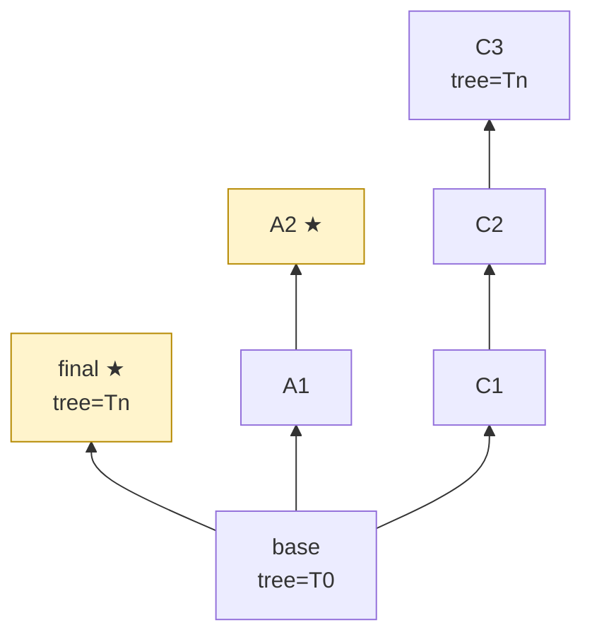
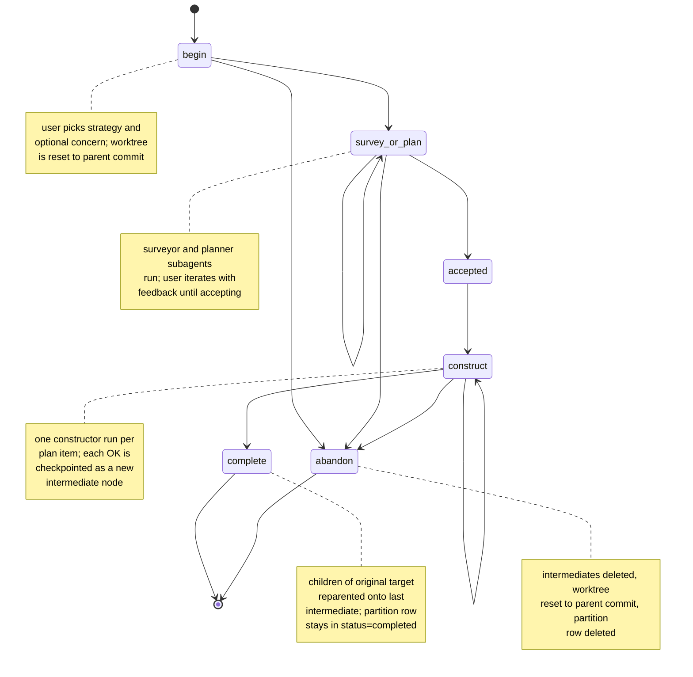
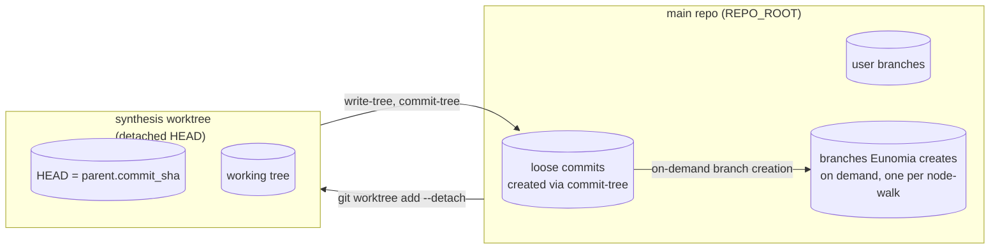
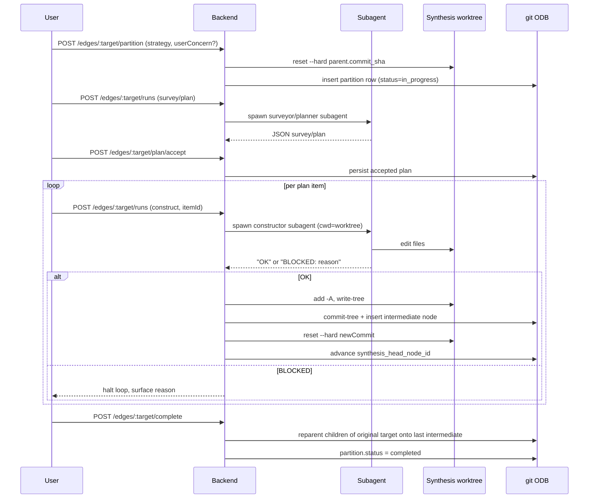

# Eunomia — Commit Review Specification

> Ported (in spirit) from the **Review History Synthesis (RHS)** feature of the
> `manage-agents` Cursor plugin. This document is a high-level mental model, not
> an implementation manual. The intent is that you can read it, decide what to
> keep, what to drop, and what to redo with different technology, before any
> code is written.

---

## 1. What Eunomia is

A standalone tool for turning a noisy "ref A → ref B" diff (a feature branch,
a rebase scratch space, or any pair of refs) into a **clean, reviewable commit
history**.

The user does **not** hand-edit commits. Instead they steer a small fleet of
AI subagents that propose plans, then construct candidate commits one by one
inside an isolated worktree. The resulting graph of virtual commits is
explorable; from it the user can spin off real branches at any time by
selecting a node and walking back to base.

Think of it as: "I have a messy WIP branch. I want a PR with 3-7 logical
commits and the same final code." Eunomia is the orchestration layer that
makes that happen.

---

## 2. Core mental model: the virtual node graph

The unit of work is a **session**. Inside a session everything is shaped like
a DAG of "virtual" commits.

- **Node** = a full cumulative tree state plus a commit sha that points at
  that tree, plus a per-node `is_favorite` UI bit (see below).
- **Edge** = the diff between a node and its parent.
- Every session starts with exactly two nodes:
  - `base` — tree of the merge-base of `baseRef` and `sourceRef`.
  - `final` — tree of `sourceRef`, parented on `base`.
- All later activity adds **intermediate nodes** between `base` and any
  descendant of `base`, forming alternative paths. Multiple alternatives can
  coexist; nothing in the model says one of them is "the" answer.
- Every non-base node has exactly one parent. Walking back through parents
  from any node terminates at `base`. That walk defines an unambiguous linear
  chain of commits a branch could be built from.



Stars mean "favorited in the UI" and nothing more (see below). Either of
`final`, `a2`, or `c3` could be turned into a branch by the user.

### Favorites (UI-only)

Users can favorite nodes from the UI. **Favoriting has no semantic effect** —
it does not influence planning, construction, branching, or any subagent
prompt. It is a pure marker, useful for visually flagging interesting
candidates while exploring the graph. Whether favorites are stored
server-side or kept in the client is a tactical decision (see §9).

### Branching out of the graph

The graph itself is never "exported." Instead, at any time, the user can
**create a real git branch from any node** in the graph:

1. User picks a node `H` (the head) and a branch name.
2. The system walks `H` → `parent` → … → `base`, producing an ordered list of
   nodes.
3. For each non-base node in that list, in order, a fresh commit is created
   with `git commit-tree` using `node.title` as the subject, parented on the
   previous step's commit. The base node's commit is the chain's root.
4. `git branch [-f] <branchName> <tip>` exposes the result as a real branch.

The branch's tip tree equals `H.treeId` by construction. Crucially the head
need **not** be `final`: the user is free to spin off a branch from any
partial path through the graph, including paths that don't reach the original
source tree. The system makes no claim that the resulting branch is
"complete" — it is whatever the user asked for.

Branching never pushes, never fetches, and never touches the user's working
copy.

---

## 3. The single primitive: partition

Every change to the graph after `createSession` happens through **edge
partitioning**. There are no other graph-mutating primitives.

A partition takes one edge of the graph (identified by its target node) and
breaks it into an ordered chain of smaller edges that, applied in order from
the original edge's parent, reproduce the original target's tree exactly. The
user picks one of three **strategies**:

| Strategy       | Intent                                                                                                        | Items typically                                             |
| -------------- | ------------------------------------------------------------------------------------------------------------- | ----------------------------------------------------------- |
| **Semantic**   | "This single diff is N independent concerns; show me each one."                                               | Number of distinct concerns the diff contains (often many). |
| **Vertical**   | "Show me a sequence of thin end-to-end tracer bullets, each cutting through every layer touched by the diff." | Small (typically ≤3).                                       |
| **Horizontal** | "Show me each architectural layer separately (e.g. native → service → plugin → UI)."                          | Roughly one item per layer touched.                         |

All three strategies share the same hard contract: the items together must
cover **exactly** the diff between `parent.tree` and `target.tree` — no more,
no less. The strategy is a hint to the planner subagent about how to slice;
it is not a different primitive.

Optionally a partition can also carry a **user concern** — a one-line piece
of prose explaining what coupling the user wants untangled. The concern is
fed to the planner regardless of strategy. (In the original plugin the
concern was mandatory for synthesis-style modes and forbidden for partition
mode; here we let any strategy accept one.)

### Lifecycle of one partition



A partition row is keyed by `(session_id, target_node_id)` and carries:

- `strategy` (`semantic` | `vertical` | `horizontal`)
- `user_concern` (optional, any strategy)
- accepted `change_survey_json` and `plan_json`
- `status` (`in_progress` | `completed`)
- `synthesis_head_node_id` — the latest intermediate, or NULL if none yet.
  Internal only; meaningless once `status = 'completed'`.

Once a partition is completed, the edge is "consumed" and cannot be
partitioned again. Further changes happen by partitioning a downstream edge.

On completion the original target node is **kept alive as a leaf
alternative**, and the original target's children are reparented onto the
last intermediate. So nothing the user had constructed downstream of the
original target is lost — both the old path and the new path remain in the
graph, and the user can branch from whichever one they prefer.

---

## 4. Git mechanics

This is the part that is easy to get wrong, so it gets its own section.

### Refs and trees

Eunomia never writes to any user-visible branch except the explicit branches
the user asks to create. All intermediate commit objects are loose — they
exist in the object database but no ref points at them. They survive across
restarts because `nodes.commit_sha` keeps them reachable through the
synthesis worktree's HEAD, and ultimately through git's reflog and any user-
created branches.

Two trees drive every decision:

- `baseTree` = `merge-base(baseRef, sourceRef)^{tree}`
- `finalTree` = `sourceRef^{tree}`

The base commit and final commit used in the graph are **fresh
`git commit-tree` objects** pointing at these trees, not the user's original
commits. This decouples Eunomia's history from the user's branch history and
guarantees the parent chain of nodes is exactly what Eunomia wrote.

### The synthesis worktree

Each session owns exactly one git worktree, the **synthesis worktree**:

```
<WORKTREES_DIR>/_review-synthesis/<sessionId>/synthesis/
```

It is added with `git worktree add --detach` from the main repo. It is the
only writable location for any subagent. It is reset and reused for every
partition; it is never deleted until the session is deleted.



### Checkpointing the worktree

When a subagent finishes editing the worktree successfully, the backend turns
the working tree state into a node:

```
git -C <worktree> add -A
treeSha   = git -C <worktree> write-tree
commitSha = git -C <REPO_ROOT> commit-tree treeSha -p parent.commit_sha -m title
git -C <worktree> reset --hard commitSha
git -C <worktree> clean -fdx
```

The new node row stores `(treeSha, commitSha, parent_node_id)`. The
worktree's HEAD is left pointing at the new commit, ready for the next item.



### Abandoning a partition

Abandon walks from `synthesis_head_node_id` up parent links until it reaches
the edge's parent node, deletes each intermediate row, hard-resets the
synthesis worktree to `parent.commit_sha`, then deletes the partition row.

The loose commits become unreferenced and will be GC'd by git eventually.
Nothing else in the graph is touched, so any other branches in the session
(including the original target's downstream chain) survive unaffected.

### Creating a branch from the graph

There is **no global "export" step**. Whenever the user wants a real branch:

1. User picks any node `H` and a branch name `B`.
2. Walk `H` → `parent` → … → `base`. Call the list `[base, N1, N2, …, H]`.
3. Starting with `parent = base.commit_sha`, for each non-base `Ni` in order:
   `parent = commit-tree(Ni.tree, parent, Ni.title)`.
4. `git branch [-f] B <parent>`.

There is no requirement that `H.tree == finalTree`. The user is free to
branch off a partial path. If they want a branch whose tip matches `finalTree`
they must pick a node whose tree equals `finalTree` — for example `final`
itself, or a leaf of a completed-and-favored partition chain.

The reason for re-creating commits at branching time (rather than reusing
`commit_sha` directly) is so each commit's subject is `node.title` and not
the placeholder messages used internally. It also means the branch's history
is self-contained and shareable.

### Invariants the system depends on

- Every non-base node has exactly one parent.
- A successful partition preserves the original target's downstream chain
  by reparenting its children onto the last intermediate, and keeps the
  original target alive as a leaf alternative.
- Only one partition may be `in_progress` per session at a time, because the
  synthesis worktree is shared per session.
- Only one subagent run may be in flight per session at a time.
- Branch creation never modifies the graph or the synthesis worktree.

---

## 5. Subagents

A small set of single-purpose AI agents. All are invoked via the Cursor SDK
with `cwd` set to the synthesis worktree and `settingSources: ["plugins"]` so
that the agents' markdown definitions are auto-loaded.

The original plugin had five agents (one surveyor, two planners, two
constructors). In the port the natural shape is **three** agents:

| Agent         | Reads                                                                                   | Writes             | Output                                                                                                                                                                           |
| ------------- | --------------------------------------------------------------------------------------- | ------------------ | -------------------------------------------------------------------------------------------------------------------------------------------------------------------------------- |
| `surveyor`    | `BeforeTree`, `TargetTree`                                                              | nothing            | `ChangeSurvey` JSON (digest of what changed). Optional preparatory step for any strategy.                                                                                        |
| `planner`     | `BeforeTree`, `TargetTree`, `strategy`, optional `userConcern`, optional `ChangeSurvey` | nothing            | `Plan` JSON: ordered list of items that together cover the diff exactly. Strategy is passed through as a parameter and changes the planner's slicing instructions in its prompt. |
| `constructor` | one plan item, full plan, optional survey                                               | synthesis worktree | `OK` / `BLOCKED: <reason>`                                                                                                                                                       |

Whether to truly merge the two original planners and the two original
constructors into one each (parameterized by strategy) or keep them as
separate agent definitions is a tactical call (see §9.6). The user-facing
contract is the same either way.

The constructor is **the only writable agent**. It is instructed to:

- Treat `git show <TargetTree>:<path>` as the source of truth for any line
  it writes. It must not invent code.
- Not commit, not `git add`, not push, not fetch, not change branches.
- Edit only the files inside `SynthesisWorktree`.
- If implementing the assigned item would require pulling in changes that
  belong to a later item, return `BLOCKED: <reason>` instead.

The output contract is strict and simple: the constructor returns exactly
one line, planners/surveyors return exactly one fenced JSON block. The
backend parses these contracts; ambiguous output is treated as failure.

---

## 6. Persistent state

A single SQLite database with four tables. Cascades are implemented in code,
not via foreign-key triggers, because the rows are coupled to on-disk
worktree state.

| Table        | Keyed by                                                                  | What it holds                                                                                                                                                   |
| ------------ | ------------------------------------------------------------------------- | --------------------------------------------------------------------------------------------------------------------------------------------------------------- |
| `sessions`   | `id` PK, with a unique constraint on whatever scopes a session (see §9.3) | refs, trees, base node id, synthesis worktree path, model id, prep status                                                                                       |
| `nodes`      | `(session_id, node_id)`                                                   | every virtual node: tree, commit sha, parent, title, `is_favorite` (UI marker; no backend logic reads it), optional metadata JSON                               |
| `partitions` | `(session_id, target_node_id)`                                            | per-edge partition state: strategy, user concern, accepted survey/plan JSON, status, `synthesis_head_node_id`                                                   |
| `runs`       | `id` autoincrement                                                        | every subagent run: session, target node, kind (survey/plan/construct), item id, status, started/finished, result JSON, optional `parent_run_id` for iterations |

`runs` is the audit log. The SSE event stream and the per-edge UI both
scope to `(session_id, target_node_id)`.

> **Open question for the port.** SQLite is simple but couples the tool to a
> single host. If Eunomia is going to be used across machines or in CI, this
> is one of the easiest layers to swap. See §9.

---

## 7. HTTP surface (high level)

The backend is a small Express app. Below is the shape of the API; exact
paths can change in the port.

### Session lifecycle

- `GET /sessions?…` — list sessions scoped by whatever attaches them to a
  repo (see §9.3).
- `POST /sessions` `{ baseRef, sourceRef, modelId? }` — create session;
  spawns the synthesis worktree asynchronously.
- `DELETE /sessions/:id` — tear down session, remove worktree.
- `PATCH /sessions/:id/model` `{ modelId }` — change the AI model used for
  runs in this session.

### Graph inspection

- `GET /sessions/:id/graph` — full node graph.
- `GET /sessions/:id/nodes/:nodeId/diff` — parent-tree → node-tree unified
  diff.
- `GET /sessions/:id/nodes/:nodeId/changed-files` / `…/file?path=…`.

### Favorite bit (UI-only)

- `POST /sessions/:id/nodes/:nodeId/favorite` `{ isFavorite }` — toggle the
  marker. No backend logic depends on this value; the endpoint just persists
  the bit so the UI can reflect it across reloads.

### Partition

- `POST /sessions/:id/edges/:targetNodeId/partition` `{ strategy, userConcern? }`
  — start; resets the synthesis worktree to the parent commit.
- `POST /sessions/:id/edges/:targetNodeId/runs` `{ kind, parentRunId?, itemId?, userFeedback? }`
  — start a subagent run; returns `{ runId }` immediately, streams progress
  via SSE.
- `POST /sessions/:id/edges/:targetNodeId/survey/accept` /
  `…/plan/accept` `{ runId }` — lock a successful run's output into the
  partition row.
- `POST /sessions/:id/edges/:targetNodeId/construct-all-remaining` —
  fire-and-forget loop that constructs every unconstructed item, halting on
  the first `BLOCKED`.
- `POST /sessions/:id/edges/:targetNodeId/complete` `{ intermediateNodeIds }`
  — close the partition; reparent the original target's children onto the
  last intermediate.
- `POST /sessions/:id/edges/:targetNodeId/abandon` — roll back.
- `DELETE /sessions/:id/edges/:targetNodeId/runs/:runId` — cancel a running
  subagent.

### Branching

- `POST /sessions/:id/nodes/:nodeId/branch` `{ branchName, force? }` — walk
  from `nodeId` back to base through parent links and create a real git
  branch with one commit per non-base node in order.

### Streaming

- `GET /sessions/:id/events` (SSE) — streams `started`, `sdk_message`,
  `phase`, `loop_progress`, `finished`, `error`, `cancelled` events for any
  in-flight run in the session.

---

## 8. UI shape (sketch)

The frontend is React + Vite. The Commit Review pane is a two-column layout:

- Right column: the **virtual node graph**, rendered with `@xyflow/react`,
  showing the DAG. Each node card displays its title, short commit/tree shas,
  a favorite star (UI-only toggle), and an inline "Branch from here…" action
  that opens a dialog asking for a branch name.
- Left column: a Tabs control with two inner tabs:
  - **Diff** — the selected node's `parent.tree → node.tree` unified diff.
  - **Partition** — the partition workflow for the selected node's incoming
    edge. Begins by asking the user for a `strategy` (Vertical / Horizontal
    / Semantic) and optionally a `userConcern`. Then shows the survey/plan,
    accept buttons, per-item construct buttons, a "construct all remaining"
    button, and an abandon button.
- Below the tabs: an **Agent run stream** that consumes the SSE feed for
  live phase updates.

The UI is purely a controller for the backend. All graph mutations and
subagent invocations go through HTTP. Favorite toggles and branch creation
are also HTTP calls; nothing meaningful happens client-side.

---
