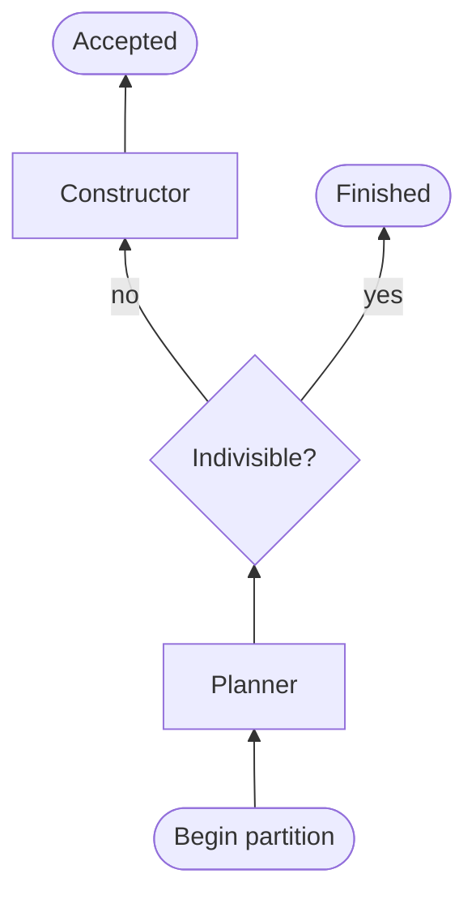
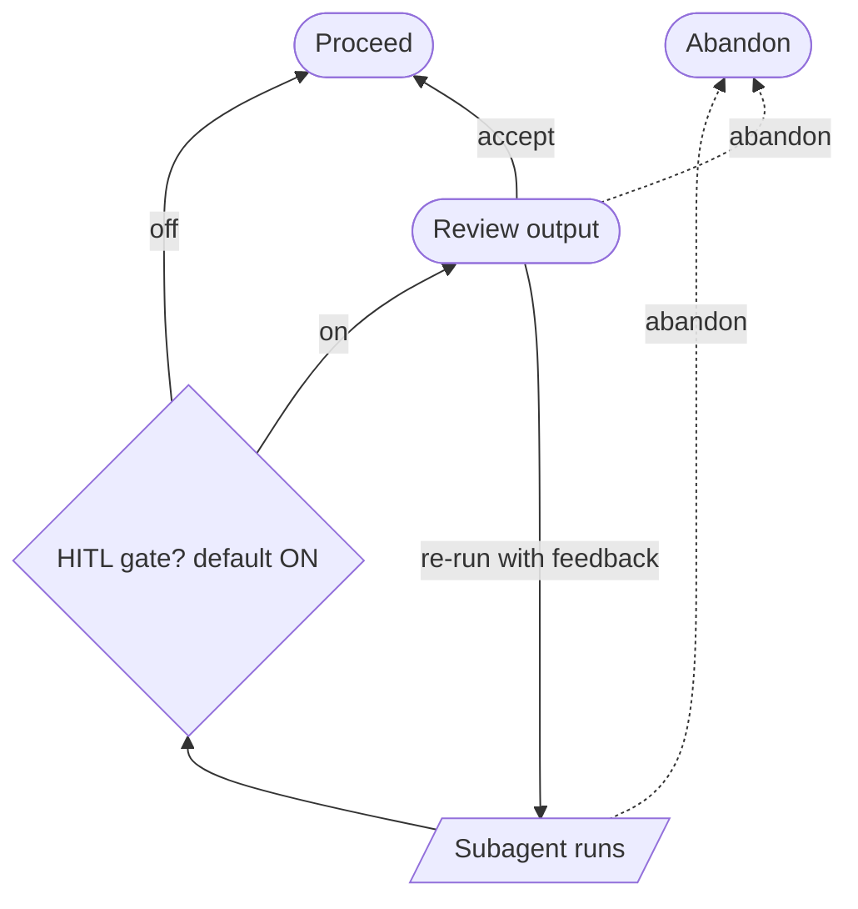
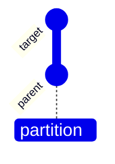
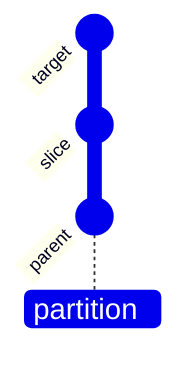

A **Partition** carves one edge of the graph into two consecutive commits. Two subagents run in sequence — Planner → Constructor — supervised by a Coordinator that owns the phase machine and human-in-the-loop (HITL) review gates. If the Planner decides the edge is already indivisible, the partition can be finished instead of constructed.

Many partitions can be pending in a session at once, including siblings on the same target.

## Subagent progression

Each partition walks through the two subagents in order:

## Per-subagent lifecycle

Each subagent follows the same phase pattern. The diagram below shows one cycle; it repeats for Planner and Constructor, each with its own HITL gate (`afterPlanning`, `afterConstruct`). Indivisible Planner outputs have their own confirmation gate (`afterIndivisible`).

**Constructor extras.** After a run, the Constructor returns `OK` or `BLOCKED: reason`. From construct review or a blocked state you can re-run the Constructor, or re-run the Planner with feedback and an optional strategy override.

## HITL defaults

All gates default to **on**. Turn any off in partition settings for a more automated run — the SDK call still happens; the gate just does not park. With `afterIndivisible` off, indivisible partitions finish automatically.

## Re-run paths

From any review gate you can accept or re-run with feedback. Re-plan from construct review or `BLOCKED` is the only back-edge that crosses subagents. Everywhere else is forward-only.

## Abandon

Available from every non-terminal state, including while a run is in flight. Sends SIGTERM to the helper subprocess, deletes the partition row, and removes its worktree.

## Parallel partitions

Each partition owns its own worktree and phase machine. Plans and constructors run in parallel across partitions. Only one run may be in flight per partition at a time.

## Graph mutation on acceptance

An accepted partition inserts a **slice** commit between the target and its prior parent, then reparents the target onto the slice:

### Before

### After

The target node keeps its tree unchanged; its title is rewritten to describe the leftover edge. The graph after acceptance is a strictly linear extension of the chain — no leaf alternatives.

## Finishing an indivisible partition

When the Planner returns an indivisible verdict, eunomio can finish the pending partition without inserting a slice. Finishing deletes the partition row and its worktree, leaves the canonical graph unchanged, and treats the target edge as complete.

If Timeline generation is enabled, finishing may start a background Timeline pass for that target edge. Timeline generation is best-effort and never blocks the finished edge.

## Inspecting candidates

While a partition waits at construct review, it does not yet appear in the canonical chain. Use the graph-view dropdown to switch into a candidate mini-graph and inspect diffs before accepting.
